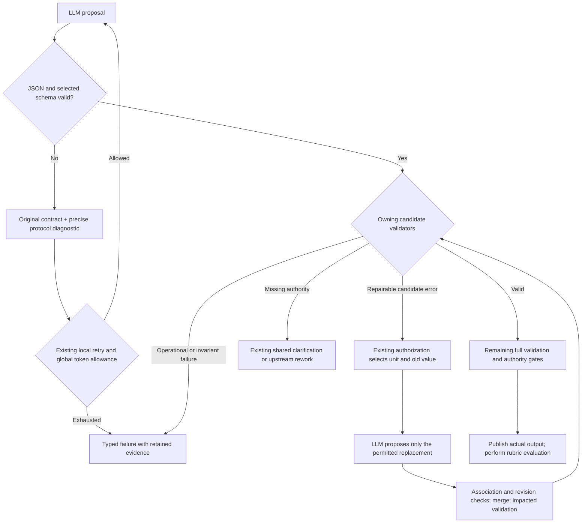

# FIX_HARNESS_001 — Engine proposal quality and E2E failure analysis

Analysis date: 12 September 2026. Git HEAD inspected:
`0c66f8cf39d2779b95c0c85002b39c2afeac2bdf`.
The working tree was clean before this report was created.

This is an analysis and recommendation document. No engine, configuration,
prompt, schema, test or policy changes were made for this analysis. No tests,
E2E runs or model calls were started. Recommendations below are proposals,
not accepted design amendments or completed fixes.

## 1. Findings that matter most

The delivery sequence, clarified by the user during the final review, is:

1. **Now: establish the first successful E2E baseline.** Run the existing base
   case through the configured real LLM, engine validation and publication to
   produce the first official `spec.md`, then complete rubric evaluation of
   that actual output. “Official” means engine-published through the production
   workflow; it does not mean a prewritten expected answer.
2. **After that baseline succeeds: exercise and compare changes.** Use the
   harness to benchmark engine code and prompt changes against the retained
   baseline, including controlled A/B runs and repeated executions to measure
   model variation.

The current failed runs are useful baseline-development diagnostics. They
identify defects and exercise code and prompts, but contain no completed output
to establish a specification-quality baseline. Building comparison machinery is
not a prerequisite for getting this first E2E case to complete. The immediate
remediation should address the shared failures below and validate that outcome.

The repeated failures reveal an incomplete **proposal → validation → guided
correction** contract. The engine rejects invalid data, but it does not
consistently explain repairable candidate failures back to the model. One
shared correction mechanism also supplies an example that violates a downstream
validator. These are concrete engine issues, not merely a model failing to obey
a correctly communicated, complete contract.

The retained evidence establishes:

1. **Correction guidance can demonstrate invalid domain data.** The generic
   schema example generator produces a retained claim that references itself.
   The latest run eventually returns that same invalid relationship pattern.
2. **Some enforced rules are absent from model-facing guidance.** The model is
   shown a response schema, but that schema and the initial prompt do not
   communicate important relationship and coverage constraints.
3. **Schema-valid candidate errors often terminate instead of receiving guided
   repair.** Reconciliation errors lose their precise cause at the application
   boundary and go directly to `end.failed`.
4. **The model is asked to reproduce some facts the engine can derive exactly.**
   This adds unnecessary fields and opportunities for inconsistency.
5. **A negative semantic review can stop execution without identifying an
   actionable missing decision or producing a clarification form.**
6. **The harness has a real call-attribution defect and incomplete failure
   summaries.** Raw evidence generally survives, but some events mix the current
   repair response with the previous candidate's origin.
7. **Native structured output did not work reliably in the observed provider,
   model and schema combination.** It is not an established remedy here.

Across **11 retained runs**, there were **132 recorded provider attempts**,
**421,345 accounted tokens**, **zero published specifications** and **zero rubric
evaluations**. Every model assignment was still preparing source evidence:
74 extraction, 55 reconciliation, two extraction repair and one pre-generation
support review. **No retained run reached the actual specification-generation
model request.** Therefore, these runs cannot establish the quality of a
generated specification, plan, task list or implementation.

## 2. Evidence and limits of the analysis

The analysis inspected all retained `report.json`, `events.jsonl`, captured
request/context files and response artifacts beneath
[`zig-out/e2e-spec`](zig-out/e2e-spec), together with the current producers,
validators, repair mechanisms, workflow transitions and report consumers.
Historical captured workflow/prompt/schema bytes were used where current source
alone could not describe an earlier request.

The governing direction is already explicit in
[design/design.md](design/design.md): §§1, 3–4 and 12 assign semantic proposals
to the LLM and validation, reconstruction and execution authority to the engine;
§§21–22 distinguish deterministic validation, atomic repair and protocol
correction; §27 requires useful diagnostics; §31 includes the applicable repair,
evidence and authority acceptance criteria. The real configured-LLM and rubric
requirements come from the user's explicit instructions and
[AGENTS.md — Testing expectations](AGENTS.md#testing-expectations).
Design §28.7 still includes fake-provider tests under its E2E heading; those
provide integration/recovery evidence and cannot satisfy the requested live
E2E acceptance. This report does not amend that legacy design wording.
The document remains marked **Proposed design**. This analysis does not change
that status.

Important limits:

- These are retained development runs of one Specify case with the configured
  Bedrock `openai.gpt-oss-20b-1:0`, not a representative benchmark of all models
  or workflows.
- Some captured inputs/workflow bytes are identical across runs, but engine
  implementation changed and historical engine binary identity was not retained.
  These exploratory runs therefore cannot isolate the effect of a particular
  code or prompt change as controlled A/B evidence. That limits causal claims;
  it does not make the runs unusable for debugging or require A/B testing before
  the first successful baseline.
- Observing an incorrect example before an incorrect response does not reveal
  the model's internal cause. Causal certainty and chronology are distinguished
  below.
- No successful publication or rubric result exists in this retained set.
  Mechanical test success cannot fill that evidence gap.
- The current production workflow directory contains Specify. Applicability of
  shared contracts to plan/tasks/implement is an architectural conclusion, not
  evidence those workflows have completed live execution.

## 3. What each retained run actually failed on

All times are UTC on 12 September 2026. A “payload check” is a recorded execution
of the engine's JSON/schema validation path. Counts below use validation events,
not a new permissive parser or the number of distinct reported call IDs. The
latter is affected by the attribution defect described in §4.6.

| Run | Mode | Calls | Tokens | Accepted payload checks | JSON / schema rejections | Terminal observation |
| --- | --- | ---: | ---: | ---: | ---: | --- |
| [R01 — 06:25:53](zig-out/e2e-spec/2026-09-12T06-25-53Z-83729e2001f8267b033c68053557ae6c/report.json) | Prompt | 2 | 6,395 | 0/2 | 0 / 2 | Unknown `/token_classifications/0/preserve/ordinal`; protocol correction ended at `g2-ex-retry`, event 67. |
| [R02 — 06:30:44](zig-out/e2e-spec/2026-09-12T06-30-44Z-1c692238da89ecf1c937d38c52a661a2/report.json) | Prompt | 5 | 13,180 | 3/5 | 2 / 0 | Reconciliation syntax failures; protocol correction ended at `g2-rc-retry`, event 152. |
| [R03 — 07:14:13](zig-out/e2e-spec/2026-09-12T07-14-13Z-f89040af117f2d747b7ad48ebc4b76fd/report.json) | Prompt | 1 | 0 | — | — | `transport_failed`; no provider response to assess. |
| [R04 — 07:15:23](zig-out/e2e-spec/2026-09-12T07-15-23Z-303ef1477f7d2f99830da358340360a6/report.json) | Prompt | 5 | 15,589 | 4/5 | 0 / 1 | Nine dispositions repeat three claim IDs; `validate-dispositions`, event 158. |
| [R05 — 07:17:26](zig-out/e2e-spec/2026-09-12T07-17-26Z-bb25aaba8067146972d5263d3a1e7b3f/report.json) | Prompt | 8 | 23,452 | 4/8 | 1 / 3 | Two retained claims but `signals: []`; `validate-signals`, event 192. |
| [R06 — 07:19:15](zig-out/e2e-spec/2026-09-12T07-19-15Z-109238cbc03e18934bb6e66361097d3c/report.json) | Prompt | 4 | 8,638 | 3/4 | 0 / 1 | Duplicate token classifications remain after repair; owning repair limit 1 exhausted at completed execution count 2, event 125. |
| [R07 — 07:23:28](zig-out/e2e-spec/2026-09-12T07-23-28Z-088179a795c62a52ae07b79e1bebf107/report.json) | Prompt | 29 | 87,823 | 5/29 | 19 / 5 | Pre-generation support review marks 11 requirements unsupported; `pre-gate` returns `needs_user`, event 440. |
| [R08 — 08:02:13](zig-out/e2e-spec/2026-09-12T08-02-13Z-ed453d80982563d1c96a948459fbb718/report.json) | Native | 1 | 0 | — | — | `transport_failed`; no provider response to assess. |
| [R09 — 08:04:14](zig-out/e2e-spec/2026-09-12T08-04-14Z-1fe73275aa91d2c8cfaeac6c1cbb08ac/report.json) | Native | 29 | 101,489 | 0/28 | 28 / 0 | Repeated malformed extraction responses exhaust the global token budget, event 359. |
| [R10 — 08:08:20](zig-out/e2e-spec/2026-09-12T08-08-20Z-5f2f0187fdf97370329aa51eb39fa16e/report.json) | Native, explicit object typing | 29 | 101,838 | 0/28 | 28 / 0 | Same failure class; global token budget exhausted, event 359. |
| [R11 — 08:21:11](zig-out/e2e-spec/2026-09-12T08-21-11Z-db6e32272690b41d790fdf5044c10fa3/report.json) | Prompt | 19 | 62,941 | 4/19 | 13 / 2 | Schema-valid retained claims reference themselves; `validate-dispositions`, event 312. |

The final call in R09 and R10 was accounted before the budget rejection, so it
did not reach payload validation. Its raw provider response remains available.
The token total exceeding 100,000 is consistent with accounting actual usage
from an already-authorized call and prohibiting further calls. It is not
evidence of a hidden output-token cap. The retained native responses have
`stopReason: end_turn`.

R03 and R08 establish transport failures, not model-quality failures. The
earlier execution history recorded sandbox connectivity restrictions, but the
retained `transport_failed` code alone cannot distinguish network causes.

These failures have different immediate causes. The candidate/validation
failures expose a shared architectural problem: the model is not consistently
guided through the complete acceptance contract once its proposal is invalid.
That finding does not explain the two transport failures.

## 4. Detailed causes and ownership

### 4.1 The shared protocol example contradicts downstream validation

The latest global reconciliation starts at R11 call 11. Its retries include
this engine-generated `schema_example`:

```json
{
  "claim_id": {"ordinal": 1},
  "disposition": "retained",
  "related_claim_ids": [{"ordinal": 1}]
}
```

That example is structurally valid under the selected JSON schema. It violates
two rules in the canonical
[claim-disposition validator](src/actions/reference/validate_reference_claim_dispositions.zig),
lines 21–37: a claim cannot relate to itself, and a retained claim must have no
related claims.

The defect is in the shared
[example generator](src/domain/model_protocol_retry.zig), lines 28–56. It chooses
the first enum (`retained`), minimum integer (`1`), and one array item even when
the array may be empty. Structural schema information alone cannot prove that
this combination is valid under domain relationships.

The recorded sequence is precise:

| Calls | Response relationship values | Correction example present |
| --- | --- | --- |
| 11 | Empty relationship arrays; field/surrounding JSON still malformed | No |
| 12–14 | Empty relationship arrays; other JSON problems remain | Retained claim 1 references itself |
| 15 | First self-references, 1→1 and 2→2 | Same invalid example |
| 16–18 | Self-references remain; JSON still fails | Same invalid example |
| 19 | JSON/schema finally passes; self-references remain | Same invalid example |

Direct evidence: [call 12 context](zig-out/e2e-spec/2026-09-12T08-21-11Z-db6e32272690b41d790fdf5044c10fa3/evidence/generation/call-000012/context.json),
[call 15 response](zig-out/e2e-spec/2026-09-12T08-21-11Z-db6e32272690b41d790fdf5044c10fa3/evidence/generation/call-000015/model_output.txt),
[call 19 response](zig-out/e2e-spec/2026-09-12T08-21-11Z-db6e32272690b41d790fdf5044c10fa3/evidence/generation/call-000019/model_output.txt).

**Established:** invalid illustrative guidance preceded the regression and
remained throughout correction. **Not established:** that the model copied it,
or that removing it alone would have completed the workflow. Calling example
values placeholders does not make the illustrated relationship valid.

This matters across the engine: a first enum value plus minimum IDs cannot
reliably illustrate task dependencies, plan relationships or authorization-bound
records either. Adding a special case for retained claims would leave the
shared defect intact.

### 4.2 The response shape was supplied; the complete acceptance rules were not

The actual initial [extraction request](zig-out/e2e-spec/2026-09-12T08-21-11Z-db6e32272690b41d790fdf5044c10fa3/evidence/generation/call-000001/request.json)
and [global reconciliation request](zig-out/e2e-spec/2026-09-12T08-21-11Z-db6e32272690b41d790fdf5044c10fa3/evidence/generation/call-000011/request.json)
include the task prompt, universal JSON instruction, complete selected schema
and input evidence. Missing initial JSON-shape guidance is therefore not an
explanation for these runs.

However, the initial [reconciliation prompt](design/workflows/spec/reconciliation.prompt.md)
only requests one disposition per claim and cited signals/conflicts. The
[input producer](src/domain/reference_model_input.zig), lines 42–55, supplies
evidence and IDs. The [schema](design/workflows/spec/reconciliation.schema.json),
lines 339–369, permits a disposition enum with a generic relationship array.
None communicates the complete dependent constraints enforced later:

- `retained`: zero related claims; `duplicate`: exactly one;
  `superseded`/`conflicting`: at least one.
- No self-relations; appropriate compatible claim kinds; symmetric conflicts;
  acyclic duplicate/supersession relationships.
- Signals must cover retained claims and non-conflicting preserved tokens, as
  enforced in [validate_reference_signal_proposals.zig](src/actions/reference/validate_reference_signal_proposals.zig),
  lines 32–34.

The model is consequently being judged against rules that are more precise
than its supplied instructions. Deterministic rejection is correct; treating
every such rejection as a terminal operational failure is not a complete
implementation of guided proposal correction.

The earlier syntax failures are still real. In R07, call 3 omitted
`/statements/0/content/kind`, despite the schema. Later responses repeatedly put
subsequent statements' keys inside one statement object, creating duplicate
fields. See [call 3](zig-out/e2e-spec/2026-09-12T07-23-28Z-088179a795c62a52ae07b79e1bebf107/evidence/generation/call-000003/model_output.txt)
and [call 12 correction](zig-out/e2e-spec/2026-09-12T07-23-28Z-088179a795c62a52ae07b79e1bebf107/evidence/generation/call-000012/context.json).
More domain guidance alone cannot be claimed to fix malformed JSON.

### 4.3 Expected candidate invalidity is collapsed into operational failure

After JSON/schema success, the engine runs domain validators. Several
reconciliation validators return `InvalidReferenceReconciliation` for different
candidate mistakes and also for context/invariant failures. The generic
application binding catches these as `OperationExecutionFailed` in
[reference_reconciliation_workflow.zig](src/application/reference_reconciliation_workflow.zig),
lines 108–135. The [workflow](design/workflows/spec.workflow.yaml), lines 384–415,
then sends summary/disposition/signal/conflict failures directly to `end.failed`.

This explains R04, R05 and R11: the model can produce schema-valid data, but the
engine does not return the actual domain rule and authorized correction scope
to it. In R11, there is no request after call 19 explaining that retained
relationships must be empty.

The problem extends beyond one reconciliation rule. Extraction text rejection,
reference-claim invalidity and specification-coverage invalidity also have
terminal transitions in the current YAML. These branches must be classified:
some are repairable candidate errors; others may require authority or environment
intervention. They must not all become retries.

The existing [candidate diagnostic union](src/domain/candidate_validation_diagnostic.zig),
lines 5–20, covers classifications, source selections and specification repair,
but not reconciliation. This is why an important failed rule can be absent from
the structured report despite the raw response being retained.

The architectural building blocks already exist:
[atomic_repair.zig](src/domain/atomic_repair.zig) supplies owner/revision/target/
old-value authorization and compare-and-swap checks;
[reference_extraction_repair.zig](src/domain/reference_extraction_repair.zig)
and [specification_repair.zig](src/domain/specification_repair.zig) reuse them.
A second repair engine is unnecessary.

### 4.4 The proposal contains unnecessary deterministic bookkeeping

Two redundancies are directly supported by code:

| Model-authored value | Existing deterministic owner |
| --- | --- |
| Summary `member_claim_ids` and `member_summary_ids` | Already fixed in the input. [Summary validation](src/actions/reference/validate_reference_reconciliation_summary.zig), lines 12–13, requires equality; [summary construction](src/actions/reference/build_reference_reconciliation_summary.zig), line 12 onward, uses engine input membership. |
| Signal/conflict citation unions accompanying selected claim IDs | [reference_reconciliation_validation.zig](src/domain/reference_reconciliation_validation.zig), lines 49–54, computes the expected union from the claims and compares it to the model's copy. |

The engine can validate selected IDs and derive these exact values. This follows
the existing direction of letting the model select evidence while the engine
reconstructs exact source data. It must not reconstruct invented semantic claims,
infer missing business decisions or remove the evidence from canonical state.

The actual latest initial requests also show substantial schema structure:

| Request | Complete schema bytes | Input bytes | Task prompt bytes |
| --- | ---: | ---: | ---: |
| Extraction, call 1 | 10,508 | 804 | 426 |
| Summary, call 4 | 7,413 | 1,743 | 320 |
| Global reconciliation, call 11 | 9,395 | 2,317 | 320 |

These are measurements of serialized text, not token estimates or proposed size
limits. They establish representational burden, not that schema size caused a
particular failure. The appropriate reduction is removal of redundant decisions
and fields, not removal of validation.

### 4.5 Semantic review can block without an actionable clarification

R07 call 29 received sources describing startup, the exact greeting and UTC
date/time. Its prompt explicitly says to assess source availability before
generation. `candidate: null` and `brief: null` are expected at this point, not
proof input was accidentally omitted.

The response marked requirements 1–11 unsupported with empty provenance, and
supported only requirement 12, the exact token. See
[call 29 context](zig-out/e2e-spec/2026-09-12T07-23-28Z-088179a795c62a52ae07b79e1bebf107/evidence/generation/call-000029/context.json)
and [response](zig-out/e2e-spec/2026-09-12T07-23-28Z-088179a795c62a52ae07b79e1bebf107/evidence/generation/call-000029/model_output.txt).
It supplied no explanation of the missing datum or requested decision because
the [review contract](src/domain/specification_support.zig), lines 11–16, has
no such field. Negative findings with empty provenance are explicitly allowed
by that implementation and the [support prompt](design/workflows/spec/support.prompt.md).

Shared [authority reconciliation](src/domain/required_authority.zig), lines
246–288, correctly routes unsupported evidence to a clarification outcome.
But pre/post support gates in the workflow go directly to `end.needs-user`
(lines 480–485 and 646–651). They do not hand the gap to the existing
clarification construction/render/publication path at lines 735–765.

**The evidence does not prove all 11 judgments were wrong.** Some required
business decisions might need clarification. It does prove the run gives the
user insufficient information to understand and resolve those judgments.
Repeating the reviewer until it says “supported” would weaken the authority
boundary, not solve that problem.

### 4.6 Harness diagnostics confuse two origins and omit terminal detail

There is a concrete observation defect in R06:

- Event 91 labels the new extraction-repair payload as `model_call: 2`, while
  its usage of 1,031 tokens belongs to repair call 3.
- Event 113 labels the next payload as call 3, while its usage of 1,021 belongs
  to repair call 4.
- Later candidate event 119 correctly attributes the invalid candidate to call 4.

The cause is visible in current [trace.zig](test/harness/e2e/trace.zig), lines
196–197: the event prefers `candidate_model_call` over the current exchange.
During repair, the previous candidate diagnostic legitimately remains live,
but it describes a different subject from the new provider response.

Consequently, the earlier analysis's R06 “2/3 valid checks” figure is an
attribution artifact. There were **four payload checks: three accepted and one
rejected**. The table in this report counts those events without collapsing
them by the incorrect call field.

The final [Report contract](test/harness/e2e/contracts.zig), lines 66–106, retains
the last model step but has no separate terminal failed-step field. The
[invocation projection](test/harness/e2e/invoke.zig), lines 79–85, can reduce the
terminal reason to `failed`. The renderer cannot recover a domain rule the
validator never emitted. Thus the latest report says model validation is absent
and the workflow failed, while the decisive relationship error has to be found
manually in events, response data and source code.

These are harness reporting problems in addition to engine repair gaps. The
harness must preserve engine diagnostics; it must not introduce another domain
validator to guess what failed.

Evidence preservation was checked separately from diagnostic completeness:

| Artifact fact | Verified result |
| --- | --- |
| Recorded call directories | 132 |
| Captured provider `response.json` files | 130 |
| Retained `model_output.txt` files | 128; every one matches the provider response text byte-for-byte |
| Two native terminal call-29 directories | Raw response, request, context and outcome exist; `model_output.txt` is absent because budget rejection preceded normal invocation observation |
| Two transport-failed calls | No provider response or output exists to preserve |
| Latest run alone | All five expected artifacts exist for all 19 calls |

It would be incorrect to claim every historical call has all five files.
Conversely, the two missing text projections do not mean the raw model response
was lost: it is retained in `response.json`. Reporting should make this
distinction explicit.

### 4.7 Native mode and retry counts are not demonstrated solutions

R09 and R10 submitted native schema constraints but received malformed prefixes
such as `{"{ "kind":...`. Each had 28 recorded JSON rejections and a final raw
response that did not reach decoding before the budget stop. The malformed
prefix is already in the provider response; it is not introduced by the engine's
candidate decoder.

Retained [simple-object probes](zig-out/native-schema-probe),
[variant probes](zig-out/native-schema-variant-probe) and
[enum-tag probes](zig-out/native-schema-enum-probe) reproduce failures with small
alternatives outside the workflow while some simple schemas succeed. These are
diagnostic calls, not E2E evidence. They do not establish that native mode fails
for every model or schema, or identify the provider's internal implementation
defect.

The supported conclusion is narrower: **native mode is not a validated quality
improvement for this configured combination**. Changing modes, changing model,
adding prompt prose or increasing retries cannot be claimed to solve the
workflow without evidence. Current prompt-only defaults preserve explicit
configuration; a silent fallback would obscure the actual tested path.

Current protocol retries already reuse the original task/input/schema plus the
latest rejected response and diagnostic. They do not accumulate the entire
correction history or have a hidden retry engine. Existing local operation
limits and the execution-wide token ledger own repetition. More calls cannot
repair an undisclosed rule or make a misleading example valid.

## 5. Why the visible failure keeps changing

The retained runs reach different rejection points because they produce
different candidates and have different implemented correction capabilities.
Fixing a JSON boundary can let a later relationship or authority defect become
visible. The shared invalid example also demonstrates how a syntax-correction
request can be accompanied by a regression in domain values.

R04, R05, R06, R07 and R11 have identical captured input/workflow bytes but
different outcomes. Engine changes prevent treating that as an isolated model
experiment. These observations remain useful for locating blockers on the path
to the first successful specification; one passing parser test or one later
failure step does not establish completion. Current evidence supports multiple
interacting failure classes, not one oscillating JSON bug.

The test should assess the whole engine's ability to turn variable, untrusted
proposals into validated output. It should not require the model to produce
one prewritten answer. Determinism means the same accepted structured payload
renders the same bytes; it does not mean all acceptable paraphrases or model
responses must be identical.

## 6. Recommended solution, using existing owners

### Priority 1 — Remove contradictory correction guidance

Change the shared protocol-correction builder, not a particular workflow prompt:

- Keep the original task, schema, evidence, exact rejected response and precise
  decoder/schema diagnostic.
- Stop manufacturing complete example responses from enum minima, minimum IDs
  and synthetic array entries.
- For a schema error, use the exact expected schema fragment/alternatives from
  the same compiled schema when focused guidance helps. Do not invent semantic
  values to illustrate them.
- Remove the superseded example generator and its documentation/tests together;
  replace tests with the new guidance contract and unrelated failure cases.

This reduces prompt content and removes the demonstrated shared defect. It
does not require a domain-aware example generator, a constraint solver or a
special rule for retained claims.

**Design decision required before implementation:** §22.6 currently mandates
schema-derived examples with array items, and §12.5 calls for a valid example.
Propose a narrow amendment allowing exact schema fragments and diagnostics in
place of fabricated domain examples. Do not silently reinterpret those clauses.
Strict output validation is unchanged by this proposal.

### Priority 2 — Complete the shared candidate rejection and repair contract

At the owning validator boundary, distinguish an expected invalid proposal from
an operational error or missing authority. Preserve a closed diagnostic carrying
the rule, affected unit, observed value, candidate revision and producing-call
origin. Reuse existing diagnostic/origin types where applicable.

The domain owns the rule and determines whether there is an independently
replaceable unit. The existing atomic authorization owns target, old value and
revision; the model returns only the permitted replacement. Registered workflow
steps then coordinate repair and revalidation using the existing runner.

| Rejection class | Appropriate existing path |
| --- | --- |
| Unparseable JSON or selected-schema failure | Response-level protocol correction; no accepted IR yet |
| Mechanically invalid candidate with a known repairable unit | Precise validator diagnostic → authorized unit replacement → impacted/dependent checks → full candidate validation |
| Genuine missing/ambiguous/conflicting business authority | Existing owner-correct clarification or upstream rework |
| Transport, operational, stale authorization or invariant failure | Preserve the typed failure/block; do not disguise it as a model-edit request |

For the latest failure, the existing rule can report that a retained claim
requires zero related IDs. With the retained decision unchanged, the affected
`related_claim_ids` list is the natural authorized unit. Replacing a larger
record or coupled group requires an actual inseparability reason under §22.1.
Retain unrelated fields, signals and source evidence, and run the relationship
and dependency checks again after merge. Do not silently clear arrays,
regenerate the entire global result, or accept a self-reference.

Apply this contract audit to reconciliation, extraction, specification coverage
and their sibling validators. Do not add an isolated `validate-dispositions`
retry branch and call the engine fixed. Different domains may contribute typed
rules and targets; continuation, authorization and retry accounting stay shared.

### Priority 3 — Make model proposals describe choices, not duplicated facts

Review the existing compact response contracts against a simple rule:
**if a field is fully determined by validated engine input or by a validated
choice, the engine should construct it at its existing owning boundary.**

Concrete candidates established by this audit are summary membership echoes
and exact citation unions. Remove those fields from model responses, preserve
ID/scope validation, and use existing canonical construction to retain the
complete evidence. Update producers, schemas, decoders, consumers, tests and
documentation together; keep no legacy parallel response format.

For choices with dependent fields, consider a closed tagged variant that exposes
only meaningful fields. A retained decision need not ask for a relationship
array; a duplicate decision needs its selected target. Deriving the empty
relationship from an accepted retained variant is different from silently
correcting an invalid model-supplied relationship. Graph-level constraints such
as no self-reference and acyclicity still require deterministic validation.

Communicate applicable relationship rules concisely from their existing owning
contract. Use typed rule codes and current constraint values for diagnostic and
guidance formatting. Do not introduce a general rule language or duplicate the
same policy in validators, YAML and independently maintained prompt paragraphs.

Keep normal variability acceptable: JSON whitespace and property order do not
need repair; grounded paraphrases should be evaluated against evidence and the
rubric. Exact classified tokens, required fields, valid references and authority
constraints remain strict.

### Priority 4 — Make support review and clarification actionable

Require a concise explanation of the missing datum or conflict for a negative
semantic finding, with relevant supplied evidence references where available.
This is an inspectable finding, not a request for lengthy reasoning narratives.
Validate the finding's structure and references without pretending the engine
can prove arbitrary semantic judgments.

Hand genuine gaps to the existing shared authority/clarification lifecycle so
the user receives a stable, answerable question. Reuse the current owner and
subject identity rules; do not create a support-review-specific clarification
system. An incomplete or malformed review can receive bounded correction of
its diagnostic record; a substantive negative judgment must not be retried
until the desired positive verdict appears.

### Priority 5 — Complete diagnostics in the existing event/report path

**Additional structured diagnostics are needed.** Most returned request/response
bytes are already captured; the main gaps are precise rejection reasons,
correct attribution and the decision taken after rejection. More copies of
prompts or full candidate snapshots would not resolve those gaps.
Report fields alone cannot recover a cause already discarded by its owner;
emit the typed diagnostic there and carry it through the existing observations.

[trace.zig](test/harness/e2e/trace.zig) already records step sequence/outcome,
request origin and attempt, selected schema/mode, usage, JSON/schema diagnostics
and retry exhaustion. Received transport outcomes retain HTTP status, provider
exception and request ID when available. Preserve these fields and extend their
existing owners only where information is missing:

| Needed observation | Existing owner and minimal addition/correction | Issue it isolates |
| --- | --- | --- |
| Exact domain rejection | Owning validator emits rule, affected field/ID, rejected value, expected constraint, candidate revision and producing origin through the shared diagnostic. Project it into events and reports. | Which schema-valid value failed and what correction is allowed; this closes the R04/R05/R11 reporting gap. |
| Current exchange versus rejected candidate | Trace retains both origins separately and uses each for its actual subject. Reuse existing request/attempt IDs and evidence links. | Whether an error describes the new replacement or an older candidate; prevents the R06 attribution error. |
| Repair decision and result | Existing authorization/runner events identify selected unit and diagnostic, revision before/after merge, revalidation result and chosen continuation. Reuse already recorded attempt/limit data. | Whether repair was offered, what could change, whether merge occurred, and why it retried, clarified or stopped. |
| Terminal failure and evidence availability | Existing report projects the failed step and its native diagnostic, separate from the last model step. Report why an expected evidence artifact is absent. | Domain failure versus protocol failure; missing capture versus unavailable response or budget stop before text projection. |
| Transport failure detail | HTTP adapter retains a closed failure phase and safe cause category through the existing transport outcome, alongside current delivery/retry classification. | Failure before sending, during sending or receiving; timeout versus an available connection/protocol cause. Do not infer DNS/TLS/network causes when the adapter lacks that evidence. |
| Actionable semantic rejection | Support-review contract supplies the concise negative finding and relevant evidence/missing decision from Priority 4; existing authority diagnostics link it to the resulting clarification. | Why support was rejected and what the user must resolve. A logger cannot reconstruct a reason the review never supplied. |
| Comparison provenance, before later A/B work | Run capture retains exact engine build/source identity, including any local source changes, alongside already captured case/prompt/schema/model/judge/rubric inputs. | Which declared code or prompt variant produced each outcome. This does not require a separate benchmarking system before the first baseline. |

The transport gap is directly visible: both R03 and R08 retain only
`transport_failed`, `policy_eligible` and `not_sent` in `outcome.json`.
[bedrock_http.zig](src/adapters/provider/bedrock_http.zig), lines 57–62, collapses
different underlying send/receive errors into `transport_failed`;
[bedrock_transport.zig](src/adapters/provider/bedrock_transport.zig)'s failure
contract has no phase or detailed cause field. These runs therefore cannot
identify the network root cause retrospectively. Preserve future detail where
it is known without changing delivery authority or retry policy.

Prioritize domain diagnostics, attribution and repair/terminal reporting with
the initial shared fixes. Transport detail makes environmental failures
diagnosable; comparison provenance prepares the later benchmark stage. Derive
correction counts from correctly attributed events. Keep `report.json` as the
report record and `report.md` as its human projection, with links to existing
call evidence. No second logger, independent harness validator, duplicate body
capture or unrestricted debug dump is needed. Preserve existing redaction and
evidence-write failure handling; diagnostic detail grants no workflow authority.

### Priority 6 — Complete the baseline, then compare changes

First use the retained failures as regression inputs at their actual owners:
misleading examples, missing tags, nested duplicate keys, retained self-relations,
duplicate dispositions, missing signal coverage and stale diagnostic origin.
Add unrelated representatives of the same contracts, such as a dependency edge
or evidence selection, rather than asserting only Hello World can pass.

Tests must also prove that targeted repair preserves siblings, stale revisions
reject, impacted and full validation run, authority gaps do not become model
defaults, and failures survive reporting. These mechanical tests are necessary
but not E2E completion evidence.

**Immediate completion criterion:** obtain explicit permission for each live
run of the existing base case, using its configured real model. The engine must
return `ok`, publish `spec.md` and the other required artifacts, and pass the
harness's publication identity checks. The evaluator must then grade those exact
published bytes and return a scored result. Retain the successful output,
inputs, configuration, exchanges, diagnostics and rubric assessment together.
A published specification followed by evaluator failure is useful progress but
leaves the full E2E run incomplete. These criteria follow the existing
[publication and evaluation contract](design/harness/e2e.md#case-and-publication-contract).

The current [rubric](test/e2e/wf-001-hello-world/node-vitest/rubric/spec.json)
has `pass_threshold_percent: null` and remains an uncalibrated draft. A completed
scored run establishes the first execution baseline; its score and findings
describe output quality without establishing an adopted quality pass. Human
review/calibration remains necessary for stronger quality claims. Do not invent
a threshold or require a finished benchmarking system before this first result.

**After the baseline succeeds:** retain its exact engine source/build identity
and captured case, configuration, prompt/schema and rubric/evaluator inputs.
Use that implementation as A and a declared code or prompt change as B. Keep
unaffected inputs and model/judge settings fixed; if a change spans code and its
prompt/schema contract, compare the declared combined change. Repeat both
variants to observe LLM and judge variation, retaining failures as well as
successes. One successful run establishes feasibility, not reliability.

The baseline specification is an observed output, not a golden answer for future
runs. Compare validated behavior and rubric findings while allowing supported
wording variation. Existing per-run evidence and reports should support this
work; no separate benchmarking framework is proposed as part of the first fix.

Use the following measures for baseline diagnosis and subsequent comparisons:

| Measure | What it answers |
| --- | --- |
| First-attempt JSON/schema acceptance | Is initial response guidance usable? |
| Recovery by rejection class | Does the engine help correct ordinary proposal variance? |
| Repeated identical rejection | Is correction making progress? |
| Tokens/calls per attempt and per completed acceptable output | Is the complete solution economical? |
| Publication and rubric outcomes separately | Did the workflow finish, and was its actual output good? |
| Clarification outcome and question | Was a genuine gap made actionable rather than hidden? |

Use the existing rubric criteria and report its threshold as unset until one is
adopted. Do not invent a completion-rate target after observing results or count
a lower failed-run token total as better output quality. A model/mode change is
a separate measured choice using the same case and rubric. No particular
alternative model is claimed here to solve these failures.

## 7. Architectural boundaries of the recommendation

The proposed flow preserves the engine's responsibilities:



This is the proposed completion of the shared contract, not a claim that every
branch is implemented today. All model calls, including replacement calls,
retain the same decoding, schema, authorization and accounting boundaries.

Do not add heuristic JSON extraction, brace insertion, duplicate-key acceptance,
model-authored paths/commands, automatic acceptance of unsupported claims,
workflow-name branches, a second repair framework, a new constraint DSL, hidden
fallback models or additional per-call output caps. Do not publish `spec.md`
early to give the rubric something to grade. A failed prerequisite should remain
visible until properly repaired or resolved.

The first implementation should remove the demonstrated contradictory examples
and make expected candidate failures explainable and repairable through the
existing machinery. Proposal simplification, actionable authority gaps and
accurate observation complete that direction. The next milestone is the first
successful base-case publication and scored rubric evaluation. Controlled
comparisons and broader reliability benchmarking follow that milestone.

## 8. Second and final review

The final review checked the findings against retained evidence, current shared
owners and the clarified delivery objective. The failure findings remain;
the report now separates baseline development from later A/B benchmarking,
corrects the E2E authority citation and coverage wording, keeps transport causes
distinct from candidate failures, and removes the implication that an adopted
rubric pass threshold already exists. Priority 5 identifies the additional
diagnostics needed to isolate failures within existing logging and reporting.
No code, policy or test configuration was changed, and no tests or model calls
were run. Completion and output quality remain unproven until the live
publication and evaluation evidence exists.
