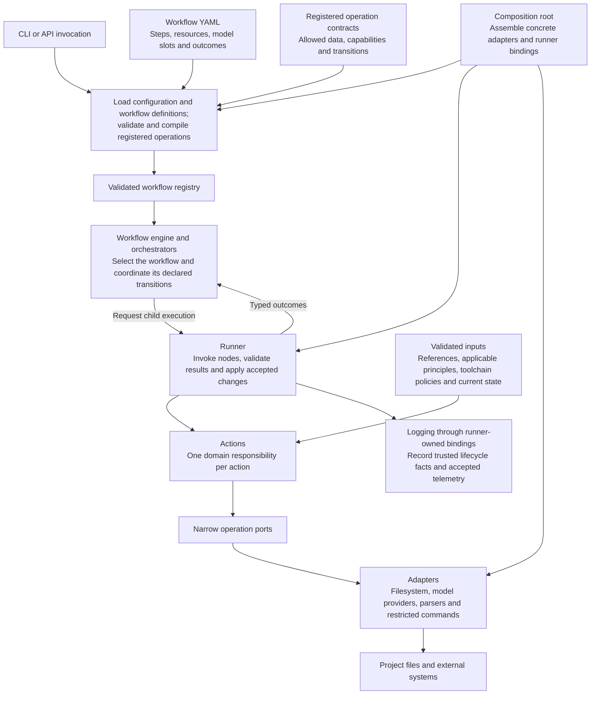

High-level responsibilities and boundaries of the workflow engine.

Workflow definitions select registered behavior. The runner owns execution;
orchestrators coordinate through its child bindings, and actions access side
effects through their declared ports. Model responses remain candidates until
engine validation accepts them. Publication requires whole-workflow success.
