This combines the implemented engine kernel with proposed SDD operations from
[design §5](../design.md#5-logical-architecture). The operation names in the SDD
group describe the proposed catalogue; they are not all production bindings.

```mermaid
flowchart TB
    ENTRY[CLI / API adapter] --> RUNNER[PipelineRunner<br/>sole node invocation, contract checks,<br/>child binding and immutable delta application]
    RUNNER --> ENGINE[WorkflowEngineOrchestrator<br/>coordinate exact selection and registered invocation parsing;<br/>follow compiled transitions only]

    COMMON[Common PipelineNode interface<br/>contract + execute envelope/runtime to Outcome]
    COMMON --> ACTION[Action<br/>one responsibility, no children]
    COMMON --> ORCH[Orchestrator<br/>coordination only, no operation ports]
    COMMON --> ENGINE

    ORCH --> BIND[Runner-owned ChildNodeBinding]
    ENGINE --> BIND
    BIND --> RUNNER
    RUNNER --> ACTION
    RUNNER --> ORCH

    subgraph OPS[Proposed SDD operations in the single versioned registry]
        GATE["authority.gate@1"]
        CONTEXT["context.build@1"]
        GENERATE["model.generate@1"]
        RECONCILE["authority.reconcile@1"]
        CLARIFY["clarification.manage@1"]
        REPAIR["model.repair@1"]
        CANDVALIDATE["candidate.validate@1"]
        COMMIT["artifact.commit@1"]
    end

    CROOT[Composition root<br/>adapters, registered operation bindings,<br/>fixed nonselectable startup graph] --> BO
    CROOT --> BIND
    RUNNER -. first bound child .-> BO[EngineStartupGraph / BootstrapOrchestrator<br/>not present in project workflow registry]
    BO -. runner-bound workflow authority actions .-> WLOAD[Workflow loader<br/>inventory/path accounting and definition schema contracts;<br/>capture, parse and schema validation]
    WLOAD --> WRES[Resolve and bounded-capture explicitly declared workflow resources<br/>prompt, result-schema, example and data aliases]
    WRES --> WCOMP[Workflow compiler<br/>closed parameters, typed data schemas and transitions;<br/>registered gates, derived capabilities and operation-local retry bounds]
    WCOMP -. result-schema resources only .-> RSCHEMA[Result-schema compiler port and JSON adapter<br/>domain-owned model-result-schema/v1 profile;<br/>opaque immutable tree bound to exact captured bytes]
    RSCHEMA -. compiled schema .-> WCOMP
    RSCHEMA -. invalid schema .-> WREJECT[Reject graph and registry publication]
    WCOMP --> WREG[Workflow registry<br/>global validation, immutable ownership and exact lookup only;<br/>arbitrary bounded definitions with unique WorkflowId and shortcode]
    WREG --> WSELECT[Parse selector, validate WorkflowId,<br/>then exact registry resolution<br/>through separate runner-bound actions]
    WSELECT -. immutable selected graph .-> ENGINE
    ENGINE -. fixed preparation child binding .-> MPREP[ModelProviderBootstrapOrchestrator<br/>capability-free; after selection and before invocation operation]
    CROOT --> MPREP
    MPREP -. runner-bound DeriveProviderRequirementAction .-> MREQ{Selected graph requires exact<br/>model-provider capability}
    MREQ -- Yes --> MLOAD[Runner-bound provider config, registry and allowlist actions<br/>one capture from paths.providers; immutable invocation authority]
    MREQ -- No provider probe or read --> INVOKE
    MLOAD -- Ready --> INVOKE[Runner invokes selected YAML-named invocation operation<br/>produces typed run context before graph entry]
    MLOAD -- Failed or cancelled --> PREPSTOP[Terminal preparation outcome; no graph entry]
    INVOKE -. typed context; runner invokes YAML start step .-> GRAPH[Selected CompiledWorkflowGraph<br/>all steps parameters resources and outcomes came from YAML]
    GRAPH -. use .-> GATE
    GRAPH -. use .-> CONTEXT
    GRAPH -. use .-> GENERATE
    GRAPH -. use .-> RECONCILE
    GRAPH -. use .-> CLARIFY
    GRAPH -. use .-> REPAIR
    GRAPH -. use .-> CANDVALIDATE
    GRAPH -. use .-> COMMIT
    GRAPH -. explicitly selected only .-> TOOLCHAIN[Registered toolchain actions<br/>capture, inventory, parse, validate, inherit, compose and validate safety;<br/>no toolchain read in fixed startup]
    GRAPH -. step contract .-> VALUES[PipelineEnvelope<br/>filtered immutable native values and schema-checked deltas;<br/>provenance/current-authority gates; sole value ownership and cleanup]
    RUNNER --> VALUES
    TOOLCHAIN -. safety-valid native owner transferred with delta .-> VALUES

    ACTION --> PORTS[Typed capability ports]
    PORTS --> FS[Contained filesystem and WAL adapter]
    PORTS --> MODEL[Versioned LLMProvider adapter]
    PORTS --> PARSER[Markdown, data, AST and source-map parsers]
    PORTS --> COMMAND[Restricted command / implementation-overlay adapter]
    PORTS --> AUTHN[Authentication and trusted-clock adapters]

    subgraph AUTHORITIES[Separate validated authorities]
        WDEFS[WorkflowDefinitionRegistry<br/>any bounded number from paths.workflows;<br/>compiled registered-operation graphs only]
        REF[Reference registry<br/>feature and business authority]
        PRINCIPLES[PrincipleRegistryState<br/>free-text Markdown from paths.principles;<br/>exact toolchain.yaml is excluded]
        PRESETS[ToolchainPresetRegistryState<br/>sole runtime root paths.toolchainPreset<br/>paths, file kinds, commands and tools]
        TLAYER[ProjectToolchainLayer<br/>exact paths.principles/toolchain.yaml;<br/>closed typed data inheriting from presets]
        STATE[Canonical workflow, actor, review, control-event,<br/>clarification and execution state]
        APOLICY[Compiler-locked requiredness, ownership<br/>and reconciliation-policy registries]
    end

    PORTS --> WDEFS
    PORTS --> REF
    PORTS --> PRINCIPLES
    PORTS --> PRESETS
    PORTS --> TLAYER
    PORTS --> STATE
    WDEFS -. exact selected graph .-> WSELECT
    REF -. typed authority and evidence .-> RECONCILE
    PRINCIPLES -. plan tasks implement authority only; never specification input .-> RECONCILE
    PRESETS -. typed authority and evidence .-> RECONCILE
    PRESETS -. validated inheritance base .-> TLAYER
    TLAYER -. typed project policy and evidence .-> RECONCILE
    STATE -. current authority and approvals .-> RECONCILE
    APOLICY -. exhaustive required slots and earliest owners .-> RECONCILE
    PRINCIPLES --> SELECT[SelectApplicablePrinciplesAction]
    SELECT --> PGUIDE[Complete bounded raw-span guidance in PipelineEnvelope]
    PGUIDE -. consumed only by the YAML-selected operation through typed data keys .-> GRAPH

    TEMPLATES[paths.templates/*.template.md<br/>inert throughout v1] -. reserved future copy contract .-> FUTUREINIT[Future sdd init template-to-principles boundary<br/>not a current v1 action or transaction; no model authority]
    FUTUREINIT -. future materialized Markdown only .-> PRINCIPLES

    COMMON --> VALIDATE[Deterministic validation actions<br/>specialized action instances]
    RUNNER --> VALIDATE
    VALIDATE --> RUNNER

    RUNNER --> OBS[PipelineTelemetryObserver<br/>trusted lifecycle and applied facts only]
    OBS --> LOGROOT[Runner-owned instrumentation root binding]
    LOGROOT --> LOG[FeatureLoggingOrchestrator]
    LOG --> LOGBIND[Runner-owned logging ChildNodeBinding]
    LOGBIND --> RUNNER
    RUNNER --> LOGA[Logging actions using the same PipelineNode interface]
    LOGA --> LOGPORT[FeatureLogPort]
    LOGA -. instrumentation IDs excluded from self-observation .-> OBS
```

The registry deep-owns compiled result schemas through execution. Request
construction and candidate validation will consume that same contract; those
model operations remain pending. Ordinary pipeline values are copied into
bounded owned storage; sealed opaque results transfer their native owner.
Execution references retain identity while capabilities stay in runner-private
tables. See [ADR 0004](../decisions/0004-model-provider-bootstrap.md),
[ADR 0005](../decisions/0005-workflow-defined-operations.md), and
[ADR 0006](../decisions/0006-minimal-model-response.md).
