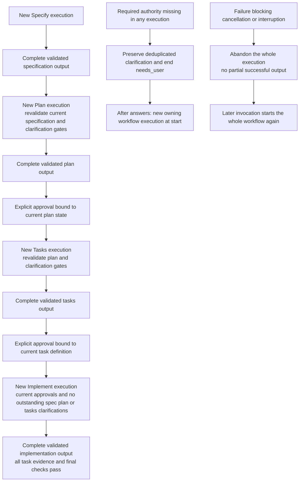

Initial SDD suite: each workflow invocation is atomic and starts at its own
compiled `start`. These domain gates do not form a fixed engine registry.
Specify resolves `--feature` relative to `.sddtoolkit.json`'s `paths.specs`
and validates the independent `--reference` selector.

No task transaction, intermediate publication or checkpoint continuation exists.
Upstream changes invalidate affected downstream authority; the next invocation
revalidates current inputs and approvals. Relevant clarification answers survive,
and user-closed forms remain unchanged. See
[ADR 0009](../decisions/0009-atomic-workflow-execution.md).
