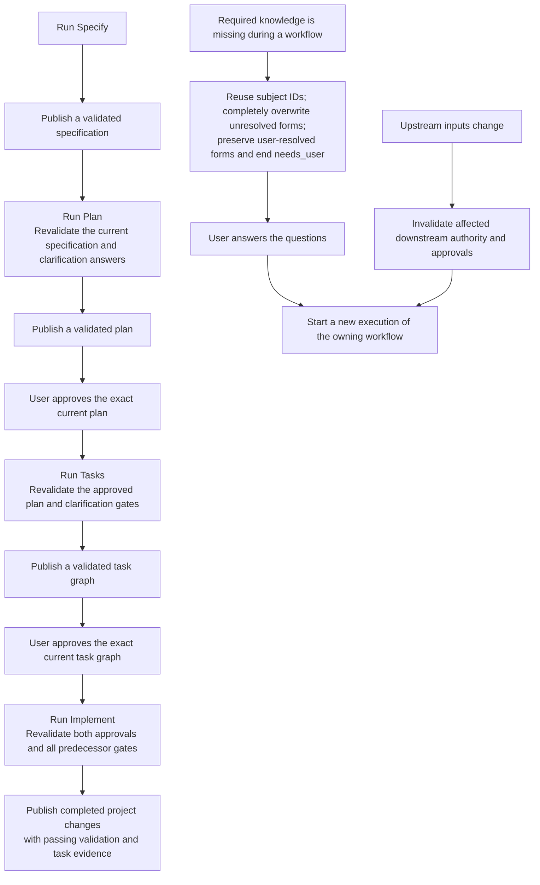

High-level progression through the Specify, Plan, Tasks and Implement workflows.

Each workflow starts from its beginning and publishes its complete output only
on success. Failure, blocking or cancellation ends that execution. Relevant
clarification answers are retained for the next run. Every workflow completely
overwrites its registered replaceable outputs and unresolved forms at the same
paths on rerun, preserving user-resolved forms byte-for-byte. Other workflow
definitions follow their own declared gates and transitions under that shared
replacement rule.

All outputs validate before publication. A publication write failure or
interruption may leave already-replaced files, but cannot record new successful
completion. Rerunning replaces the complete output set; there is no rollback or
recovery store. User-closed clarification files remain protected throughout.
