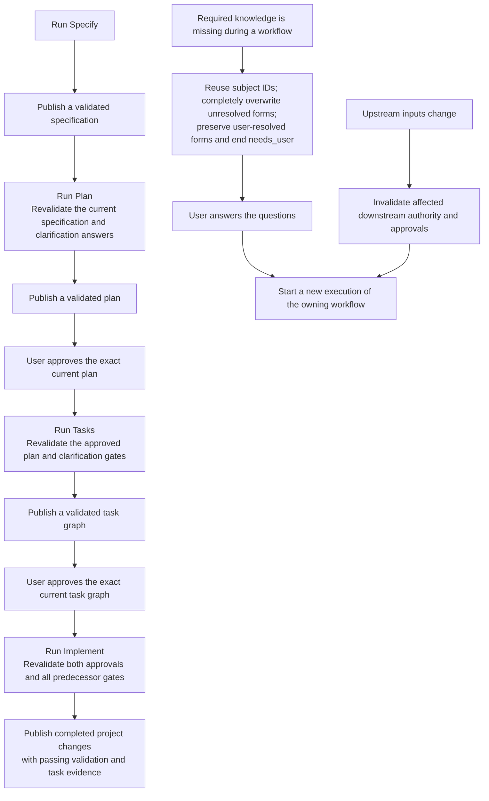

High-level progression through the Specify, Plan, Tasks and Implement workflows.

These predecessor gates apply to the initial SDD suite; unrelated workflows
follow their own compiled transitions. See [Design §24](../design.md#24-state-sequence-and-recovery-without-fingerprints).

Every invocation starts at `start`. [ADR 0009](../decisions/0009-atomic-workflow-execution.md)
owns whole-workflow publication and failure behavior;
[§23.2](../design.md#232-workflow-reruns-and-protected-clarification-files)
owns unresolved-form replacement and byte-preserved user-closed forms.
