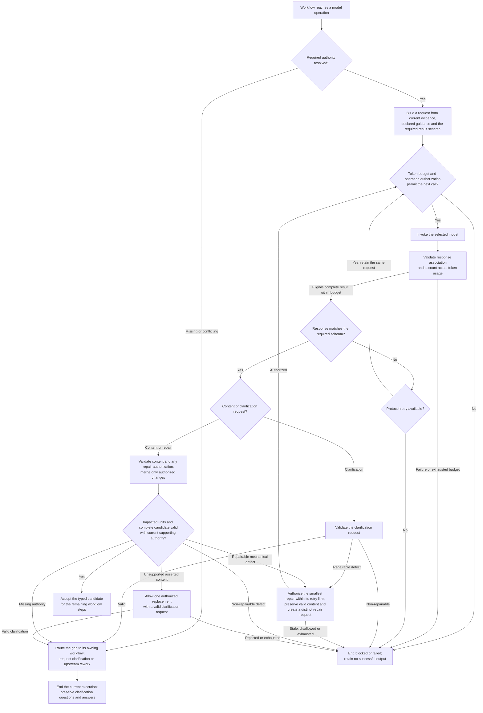

High-level flow for generating, validating and repairing model-produced content.

A request retains its originating workflow-step identity, model binding and
resources as it passes between steps. Protocol retries retain that request;
repairs receive distinct requests. Every model call follows the declared
authorization, token accounting and retry rules. Provider failure or cancellation
keeps its own outcome. Semantic review is model-assisted; accepted content is
published only after the complete workflow succeeds.
