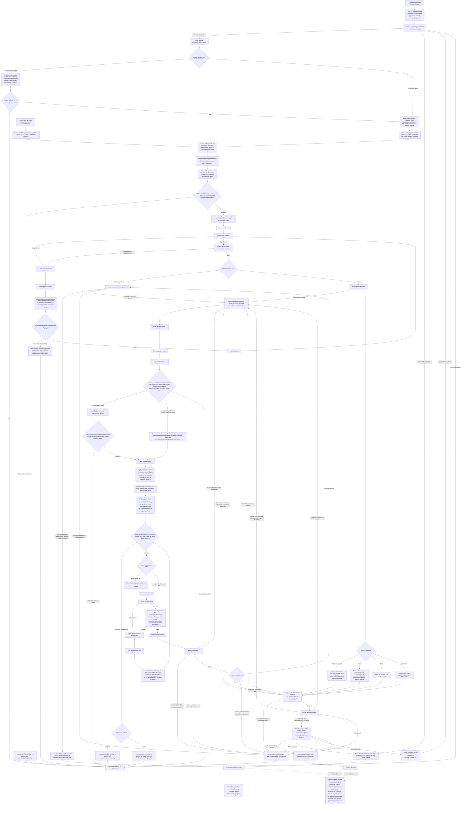

```mermaid
flowchart TD
    VG[Compiled YAML model-operation subgraph] --> AREQ[Build and validate complete AuthorityRequirementLedger<br/>from closed schemas obligations policies and accepted authority]
    AREQ --> ARECON[AuthorityReconciliationOrchestrator<br/>one validated closed outcome per structural requirement]
    ARECON -- All required authority resolved --> CTX[Select bounded authoritative context actions]
    ARECON -- Same-stage clarification required --> GAPNEED[BuildAuthorityGapClarificationNeedAction<br/>registered subject question why and answer schema]
    GAPNEED --> CL
    ARECON -- Earlier owner requires rework --> REWORK[Section 24.5 owner-derived invalidation and regeneration<br/>no local substitute or shallower owner]
    ARECON -- Administrative block --> STOP
    CTX --> PSTAGE{Declared operation uses technical principles}
    PSTAGE -- Plan tasks or implement --> PSEL[Select every raw principle chunk/span in configured eligible filename categories<br/>free text is never ranked, summarized or omitted by inferred meaning]
    PSTAGE -- Reference or specify --> GUIDE[Build initial deterministic guidance action<br/>closed schema, allowed IDs, preset rules, limits and minimal example]
    PSEL --> PFIT{Complete selection fits the compiled operation budget}
    PFIT -- No --> STOP[Blocked or failed unit; no artifact write]
    PFIT -- Yes --> GUIDE
    EPOCH[Trusted stage-run epoch and closed request-purpose registry] --> MLEDGER[BuildInitialModelRequestIdentityLedgerAction<br/>once for the run; initialize no request implicitly]
    GUIDE --> UOWNER[BuildImmutableUnitOwnerIdAction<br/>closed stage-specific owner tuple from current canonical authorities]
    UOWNER --> MID[AssignModelRequestIdAction<br/>allocate one generation-purpose logical request ID from the current run-local ledger]
    MLEDGER --> MID
    MID --> MBIND[ValidateModelRequestBindingAction<br/>prove epoch, unit, compiled operation, purpose, ordinal and ledger membership]
    MBIND --> REQ[BuildModelRequestAction<br/>versioned request carrying only the validated engine-owned request identity]
    REQ --> MADV{AdvanceModelAttemptAccountingAction<br/>reserve the initial call against maxModelAttemptsPerUnit}
    MADV -- Exhausted; invoke nothing --> MNOTINVOKED[AdvanceModelRequestLifecycleAction<br/>compare-and-swap assigned to terminal with not_invoked_attempt_ceiling]
    MNOTINVOKED --> STOP
    MADV -- Reserved --> MINVOKED[AdvanceModelRequestLifecycleAction<br/>compare-and-swap assigned to invoked exactly once]
    MINVOKED --> CALL[InvokeModelAction]
    CALL --> DECODE[Decode model envelope action]

    DECODE -- No typed result --> PROTO[YAML-declared protocol-retry operation]
    PROTO --> PG[Build protocol-only retry guidance action]
    PG --> PREQ[ValidateModelRequestBindingAction then BuildModelRequestAction<br/>protocol-only retry retaining the same exact logical request ID;<br/>do not allocate or repeat assigned-to-invoked]
    PREQ --> PMADV{AdvanceModelAttemptAccountingAction<br/>reserve this retry against the same total call ceiling}
    PMADV -- Exhausted; invoke nothing --> PTERM[AdvanceModelRequestLifecycleAction<br/>compare-and-swap invoked to terminal with invalid_exhausted<br/>for the protocol-attempt ceiling]
    PTERM --> STOP
    PMADV -- Reserved --> PCALL[InvokeModelAction]
    PCALL --> DECODE

    DECODE -- Typed result --> IDENT[Validate request identity and workflow-declared result schema actions]
    IDENT -- Invalid envelope identity/schema --> PROTO
    IDENT -- Valid --> ROUTE{Closed operation-result discriminator}

    ROUTE -- clarification_needed --> NEED[ValidateClarificationNeedProposalAction]
    NEED -- Valid genuine current authority gap; no repair budget consumed --> NACCEPT[AdvanceModelRequestLifecycleAction<br/>terminalize the current invoked producing request with needs_user]
    NACCEPT --> CL[ClarificationLifecycleOrchestrator]
    CL --> USER[NeedsUser; commit the complete stage-specific pause authority set,<br/>forms and pending workflow state; persist no partial stage IR]
    NEED -- Repairable invalid need proposal --> CREJECT[AdvanceModelRequestLifecycleAction<br/>terminalize the current invoked producing request with failed<br/>before allocating a distinct repair request]
    NEED -- Non-repairable policy or environment defect --> CFAIL[AdvanceModelRequestLifecycleAction<br/>terminalize the current invoked producing request with blocked/failed fact]

    ROUTE -- content --> UNIT[Stage-specific identity and unit-schema actions]
    UNIT -- Invalid identity/schema --> CREJECT
    UNIT --> FILEMODE{Stage file-reference contract}
    FILEMODE -- Reference or specify --> SFILES[Engine artifact selectors and source/passive-literal IDs only<br/>reject unbound operational path-shaped prose]
    FILEMODE -- Plan --> PFILES[Existing fileId or engine-materialized preset PathCandidateId<br/>raw create fallback only when explicitly enabled and fully validated]
    FILEMODE -- Tasks --> TFILES[Approved PlanState fileIds and grants only]
    FILEMODE -- Implement --> IFILES[Approved fileId, copy sourceId and operation-intent ID only]
    SFILES --> VALIDATE[Stage-specific deterministic validators<br/>run before rendering, transaction staging or project writes]
    PFILES --> VALIDATE
    TFILES --> VALIDATE
    IFILES --> VALIDATE
    VALIDATE -- Asserted content lacks or conflicts with authority, one repair only --> CREJECT
    VALIDATE -- Non-repairable policy or environment defect --> CFAIL
    VALIDATE -- Repairable deterministic defect --> CREJECT
    VALIDATE -- Unit valid --> FULL[Run full candidate validator set]
    FULL -- Structurally and semantically valid candidate --> RECON2[Rebuild and validate the complete authority-reconciliation projection<br/>immediately before accepting the unit or stage candidate]
    RECON2 -- All required authority resolved --> UACCEPT[AdvanceModelRequestLifecycleAction<br/>terminalize the current invoked producing request with accepted content result]
    RECON2 -- Same-stage gap --> GAPNEED
    RECON2 -- Earlier-owner gap --> REWORK
    RECON2 -- Administrative block --> CFAIL
    UACCEPT --> OK[Accepted typed unit]
    FULL -- Asserted content lacks or conflicts with authority, one repair only --> CREJECT
    FULL -- Non-repairable --> CFAIL
    FULL -- Repairable deterministic defect --> CREJECT
    CREJECT --> REPAIR
    CFAIL --> STOP

    REPAIR[YAML-declared atomic-repair operation] --> ORDER[Order diagnostics action]
    ORDER --> ONE[Select exactly one diagnostic action]
    ONE --> PURPOSE{ClassifyRepairAuthorizationPurposeAction<br/>selected diagnostic, embedded validated SemanticFinding if present,<br/>operation-result kind and closed purpose table}
    PURPOSE -- Ordinary atomic repair --> OAUTH[CreateRepairAuthorizationAction<br/>one candidate ID, pointer, operation and revision]
    OAUTH --> OADV{AdvanceAtomicRepairAttemptAccountingAction<br/>compare-and-swap ordinary repair counter before invocation}
    OADV -- Exhausted; emit no transition --> STOP
    OADV -- Advanced --> RGUIDE[Build preset-specific atomic repair guidance action]
    PURPOSE -- unsupported_behavior SemanticFinding on content --> NAUTH[CreateNoInventionClarificationReplacementAuthorizationAction<br/>unit-local one-shot; authorize only whole operation-result replacement<br/>from content to schema-valid clarification_needed]
    NAUTH --> RGUIDE
    PURPOSE -- Nonrepairable evidence --> STOP
    RGUIDE --> RIDENT[AssignModelRequestIdAction<br/>allocate a distinct purpose-bound repair request ID from the current run-local ledger;<br/>reuse the same immutable unit owner but never the generation request ID]
    RIDENT --> RBIND[ValidateModelRequestBindingAction<br/>prove the exact repair authorization is the purpose owner]
    RBIND --> RREQ[BuildModelRequestAction for the YAML-selected repair operation;<br/>the new repair request ID has its own bounded model-attempt counter<br/>and remains subject to the unit/stage repair authorization cap]
    RREQ --> RMADV{AdvanceModelAttemptAccountingAction<br/>reserve every initial or retry call for this repair request ID}
    RMADV -- Exhausted; invoke nothing --> RCEIL{Current repair-request lifecycle status}
    RCEIL -- assigned --> RNOTINVOKED[AdvanceModelRequestLifecycleAction<br/>compare-and-swap assigned to terminal with not_invoked_attempt_ceiling]
    RCEIL -- invoked --> RABORT[AdvanceModelRequestLifecycleAction<br/>compare-and-swap invoked to terminal with invalid_exhausted<br/>for the protocol-attempt ceiling]
    RNOTINVOKED --> STOP
    RABORT --> STOP
    RMADV -- Reserved --> RINVOKED{Repair request lifecycle status}
    RINVOKED -- assigned; first call --> RSTART[AdvanceModelRequestLifecycleAction<br/>compare-and-swap assigned to invoked]
    RSTART --> RCALL[InvokeModelAction]
    RINVOKED -- already invoked; protocol retry --> RCALL
    RCALL --> RDECODE[Decode repair envelope]
    RDECODE -- No typed repair --> RPROTO[YAML-declared protocol-retry operation]
    RPROTO --> RPG[Build repair-protocol retry guidance]
    RPG --> RPREQ[ValidateModelRequestBindingAction then BuildModelRequestAction<br/>protocol-only retry retaining the same repair request ID;<br/>do not allocate or repeat assigned-to-invoked]
    RPREQ --> RMADV
    RDECODE -- Typed repair --> RSCOPE[ValidateRepairEnvelopeAction then ValidateRepairScopeAction<br/>prove identity, authorization, pointer and one-operation scope;<br/>consume the unit-local one-shot only for no-invention replacement]
    RSCOPE -- Invalid --> RPROTO
    RSCOPE -- Valid --> MERGE[MergeAtomicRepairAction]
    MERGE --> IMPACT[Run producing and dependent validators]
    IMPACT -- Invalid within ordinary field-repair budget --> CREJECT
    IMPACT -- Invalid after the one operation-result replacement repair --> CFAIL
    IMPACT -- Exhausted or non-repairable --> CFAIL
    IMPACT -- Valid --> RROUTE{Repaired candidate result}
    RROUTE -- clarification_needed --> NEED
    RROUTE -- content from ordinary field repair --> VALIDATE
    RROUTE -- content or malformed result after operation-result replacement authorization --> CFAIL

    TX09REF[Diagram 09 feature-storage lifecycle is invoked only when the owning stage<br/>commits an accepted candidate or clarification pause: acquire/recover feature storage,<br/>reserve/fsync transaction ID before the stage builder, validate DurableTransactionMember,<br/>commit or retire, clean up and release; no lock is held during model or repair calls]
    CL -. clarification-pause transaction .-> TX09REF
    OK -. owning-stage candidate transaction .-> TX09REF
```
