Proposed generation and repair flow under
[ADR 0006](../decisions/0006-minimal-model-response.md). Result-schema
compilation, request/attempt accounting, provider authorization and token-budget
primitives exist; the complete model-operation graph, request construction and
candidate decoding/validation remain pending. Every retry/repair branch below
belongs to the declared YAML graph.

```mermaid
flowchart TD
    VG[Compiled YAML model-operation subgraph] --> AREQ[Build and validate complete AuthorityRequirementLedger<br/>from closed schemas obligations policies and accepted authority]
    AREQ --> ARECON[AuthorityReconciliationOrchestrator<br/>one validated closed outcome per structural requirement]
    ARECON -- All required authority resolved --> CTX[Select bounded authoritative context actions]
    ARECON -- Same-stage clarification required --> GAPNEED[BuildAuthorityGapClarificationNeedAction<br/>registered subject question why and answer schema]
    GAPNEED --> CL
    ARECON -- Earlier owner requires rework --> REWORK[Section 24.5 owner-derived invalidation and regeneration<br/>no local substitute or shallower owner]
    ARECON -- Administrative block --> STOP
    CTX --> PSTAGE{Declared operation uses technical principles}
    PSTAGE -- Plan tasks or implement --> PSEL[Select every raw principle chunk/span in configured eligible filename categories<br/>free text is never ranked, summarized or omitted by inferred meaning]
    PSTAGE -- Reference or specify --> GUIDE[Build initial deterministic guidance action<br/>closed schema, allowed IDs, preset rules, limits and minimal example]
    PSEL --> PFIT{Complete selection fits the compiled operation budget}
    PFIT -- No --> STOP[Blocked, failed or cancelled unit; no artifact write]
    PFIT -- Yes --> GUIDE
    EPOCH[Trusted stage-run epoch and closed request-purpose registry] --> MLEDGER[BuildInitialModelRequestIdentityLedgerAction<br/>once for the run; initialize no request implicitly]
    GUIDE --> UOWNER[BuildImmutableUnitOwnerIdAction<br/>closed stage-specific owner tuple from current canonical authorities]
    UOWNER --> MID[AssignModelRequestIdAction<br/>allocate one generation-purpose logical request ID from the current run-local ledger]
    MLEDGER --> MID
    MID --> MBIND[ValidateModelRequestBindingAction<br/>prove epoch, unit, compiled operation, purpose, ordinal and ledger membership]
    MBIND --> REQ[BuildModelRequestAction<br/>retain engine identity internally;<br/>send needed guidance, evidence and the already compiled compact result schema]
    RSCHEMA[Workflow-registry-owned model-result-schema/v1 authority<br/>opaque closed tree and exact captured resource bytes;<br/>invalid schema rejects during workflow compilation] -. borrowed schema; no second parser .-> REQ
    REQ --> MADV[AdvanceModelAttemptAccountingAction<br/>reserve initial attempt ordinal; no global attempt ceiling]
    MADV --> MINVOKED[AdvanceModelRequestLifecycleAction<br/>compare-and-swap assigned to invoked exactly once]
    MINVOKED --> MTOKEN{CheckWorkflowTokenBudgetAction<br/>current actual usage below execution budget?}
    MTOKEN -- Exhausted or unavailable --> MTTERM[Runner budget error; invoke nothing]
    MTTERM --> STOP
    MTOKEN -- Available --> CALL[InvokeModelAction]
    CALL --> OBS{ValidateProviderInvocationObservationAction<br/>exact runner-owned call association and complete-result eligibility}
    OBS -- Invalid trusted association --> STOP
    OBS -- Associated usage or non-delivery --> MUSE{ReconcileWorkflowTokenUsageAction<br/>record actual input plus output once}
    MUSE -- Exceeded or unavailable --> STOP
    MUSE -- Complete candidate within budget --> DECODE[DecodeModelEnvelopeAction<br/>parse one compact JSON object and retain trusted binding]
    MUSE -- Failure, stopped or cancelled --> POUT[Compiled YAML provider outcome;<br/>no candidate decode or protocol repair]

    DECODE -- No typed result --> PROTO[YAML-declared protocol-retry operation]
    PROTO --> PG[Build protocol-only retry guidance action]
    PG --> PREQ[ValidateModelRequestBindingAction then BuildModelRequestAction<br/>protocol-only retry retaining the same exact logical request ID;<br/>do not allocate or repeat assigned-to-invoked]
    PREQ --> PMADV{AdvanceModelAttemptAccountingAction<br/>reserve this retry against the YAML operation instance's explicit retry-limit}
    PMADV -- Explicit retry limit exhausted; invoke nothing --> PTERM[AdvanceModelRequestLifecycleAction<br/>compare-and-swap invoked to terminal with invalid_exhausted]
    PTERM --> STOP
    PMADV -- Reserved --> PTOKEN{CheckWorkflowTokenBudgetAction<br/>same execution's actual usage}
    PTOKEN -- Exhausted or unavailable --> PTERM
    PTOKEN -- Available --> PCALL[InvokeModelAction]
    PCALL --> OBS

    DECODE -- Parsed result --> SCHEMA[ValidateModelPayloadSchemaAction<br/>exact bound compact result schema]
    SCHEMA -- Invalid result schema --> PROTO
    SCHEMA -- Valid --> ROUTE{Declared result variant;<br/>single object has no constant kind echo;<br/>oneOf alternatives require distinct root kind constants}

    ROUTE -- clarification_needed --> NEED[ValidateClarificationNeedProposalAction]
    NEED -- Valid genuine current authority gap; no operation retry consumed --> NACCEPT[AdvanceModelRequestLifecycleAction<br/>terminalize the current invoked producing request with needs_user]
    NACCEPT --> CL[ClarificationLifecycleOrchestrator]
    CL --> USER[NeedsUser; commit the complete stage-specific pause authority set,<br/>forms and pending workflow state; persist no partial stage IR]
    NEED -- Repairable invalid need proposal --> CREJECT[AdvanceModelRequestLifecycleAction<br/>terminalize the current invoked producing request with failed<br/>before allocating a distinct repair request]
    NEED -- Non-repairable policy or environment defect --> CFAIL[AdvanceModelRequestLifecycleAction<br/>terminalize the current invoked producing request with blocked/failed fact]

    ROUTE -- content --> UNIT[Stage-specific identity and unit-schema actions]
    UNIT -- Invalid identity/schema --> CREJECT
    UNIT --> FILEMODE{Stage file-reference contract}
    FILEMODE -- Reference or specify --> SFILES[Engine artifact selectors and source/passive-literal IDs only<br/>reject unbound operational path-shaped prose]
    FILEMODE -- Plan --> PFILES[Existing fileId or engine-materialized preset PathCandidateId<br/>raw create fallback only when explicitly enabled and fully validated]
    FILEMODE -- Tasks --> TFILES[Approved PlanState fileIds and grants only]
    FILEMODE -- Implement --> IFILES[Approved fileId, copy sourceId and operation-intent ID only]
    SFILES --> VALIDATE[Stage-specific deterministic validators<br/>run before rendering, transaction staging or project writes]
    PFILES --> VALIDATE
    TFILES --> VALIDATE
    IFILES --> VALIDATE
    VALIDATE -- Asserted content lacks or conflicts with authority, one repair only --> CREJECT
    VALIDATE -- Non-repairable policy or environment defect --> CFAIL
    VALIDATE -- Repairable deterministic defect --> CREJECT
    VALIDATE -- Unit valid --> FULL[Run full candidate validator set]
    FULL -- Structurally and semantically valid candidate --> RECON2[Rebuild and validate the complete authority-reconciliation projection<br/>immediately before accepting the unit or stage candidate]
    RECON2 -- All required authority resolved --> UACCEPT[AdvanceModelRequestLifecycleAction<br/>terminalize the current invoked producing request with accepted content result]
    RECON2 -- Same-stage gap --> GAPNEED
    RECON2 -- Earlier-owner gap --> REWORK
    RECON2 -- Administrative block --> CFAIL
    UACCEPT --> OK[Accepted typed unit]
    FULL -- Asserted content lacks or conflicts with authority, one repair only --> CREJECT
    FULL -- Non-repairable --> CFAIL
    FULL -- Repairable deterministic defect --> CREJECT
    CREJECT --> REPAIR
    CFAIL --> STOP

    REPAIR[YAML-declared atomic-repair operation] --> ORDER[Order diagnostics action]
    ORDER --> ONE[Select exactly one diagnostic action]
    ONE --> PURPOSE{ClassifyRepairAuthorizationPurposeAction<br/>selected diagnostic, embedded validated SemanticFinding if present,<br/>operation-result kind and closed purpose table}
    PURPOSE -- Ordinary atomic repair --> OAUTH[CreateRepairAuthorizationAction<br/>one candidate ID, pointer, operation and revision]
    OAUTH --> OADV{AdvanceAtomicRepairAttemptAccountingAction<br/>compare-and-swap the YAML repair operation instance's explicit retry counter}
    OADV -- Explicit retry limit exhausted; emit no transition --> STOP
    OADV -- Advanced --> RGUIDE[Build preset-specific atomic repair guidance action]
    PURPOSE -- unsupported_behavior SemanticFinding on content --> NAUTH[CreateNoInventionClarificationReplacementAuthorizationAction<br/>unit-local one-shot; authorize only whole operation-result replacement<br/>from content to schema-valid clarification_needed]
    NAUTH --> RGUIDE
    PURPOSE -- Nonrepairable evidence --> STOP
    RGUIDE --> RIDENT[AssignModelRequestIdAction<br/>allocate a distinct purpose-bound repair request ID from the current run-local ledger;<br/>reuse the same immutable unit owner but never the generation request ID]
    RIDENT --> RBIND[ValidateModelRequestBindingAction<br/>prove the exact repair authorization is the purpose owner]
    RBIND --> RREQ[BuildModelRequestAction for the YAML-selected repair operation;<br/>the new repair request ID has its own ordinal sequence;<br/>any retry uses that operation instance's explicit retry-limit]
    RREQ --> RMADV{AdvanceModelAttemptAccountingAction<br/>reserve the initial attempt or an explicitly bounded retry for this repair request ID}
    RMADV -- Explicit retry limit exhausted on an invoked retry; invoke nothing --> RABORT[AdvanceModelRequestLifecycleAction<br/>compare-and-swap invoked to terminal with invalid_exhausted]
    RABORT --> STOP
    RMADV -- Reserved --> RINVOKED{Repair request lifecycle status}
    RINVOKED -- assigned; first call --> RSTART[AdvanceModelRequestLifecycleAction<br/>compare-and-swap assigned to invoked]
    RSTART --> RTOKEN{CheckWorkflowTokenBudgetAction<br/>same execution's actual usage}
    RINVOKED -- already invoked; protocol retry --> RTOKEN
    RTOKEN -- Exhausted or unavailable --> RABORT
    RTOKEN -- Available --> RCALL[InvokeModelAction]
    RCALL --> ROBS{ValidateProviderInvocationObservationAction<br/>exact repair-call association and complete-result eligibility}
    ROBS -- Invalid trusted association --> STOP
    ROBS -- Associated usage or non-delivery --> RUSE{ReconcileWorkflowTokenUsageAction<br/>record actual input plus output once}
    RUSE -- Exceeded or unavailable --> STOP
    RUSE -- Complete candidate within budget --> RDECODE[DecodeModelEnvelopeAction then ValidateModelPayloadSchemaAction<br/>compact repair result and bound schema]
    RUSE -- Failure, stopped or cancelled --> POUT
    RDECODE -- No typed repair --> RPROTO[YAML-declared protocol-retry operation]
    RPROTO --> RPG[Build repair-protocol retry guidance]
    RPG --> RPREQ[ValidateModelRequestBindingAction then BuildModelRequestAction<br/>protocol-only retry retaining the same repair request ID;<br/>do not allocate or repeat assigned-to-invoked]
    RPREQ --> RMADV
    RDECODE -- Typed repair --> RBOUND{ValidateRepairEnvelopeAction<br/>retained authorization, diagnostic and current candidate revision}
    RBOUND -- Invalid or stale authority --> STOP
    RBOUND -- Valid --> RSCOPE[ValidateRepairScopeAction<br/>prove authorized pointer/key set and one-operation scope;<br/>consume the unit-local one-shot only for no-invention replacement]
    RSCOPE -- Invalid --> RPROTO
    RSCOPE -- Valid --> MERGE[MergeAtomicRepairAction]
    MERGE --> IMPACT[Run producing and dependent validators]
    IMPACT -- Invalid within the repair operation's explicit retry limit --> CREJECT
    IMPACT -- Invalid after the one operation-result replacement repair --> CFAIL
    IMPACT -- Exhausted or non-repairable --> CFAIL
    IMPACT -- Valid --> RROUTE{Repaired candidate result}
    RROUTE -- clarification_needed --> NEED
    RROUTE -- content from ordinary field repair --> VALIDATE
    RROUTE -- content or malformed result after operation-result replacement authorization --> CFAIL

    TX09REF[Diagram 09 feature-storage lifecycle is invoked only when the owning stage<br/>commits an accepted candidate or clarification pause: acquire/recover feature storage,<br/>reserve/fsync transaction ID before the stage builder, validate DurableTransactionMember,<br/>commit or retire, clean up and release; no lock is held during model or repair calls]
    CL -. clarification-pause transaction .-> TX09REF
    OK -. owning-stage candidate transaction .-> TX09REF
```

