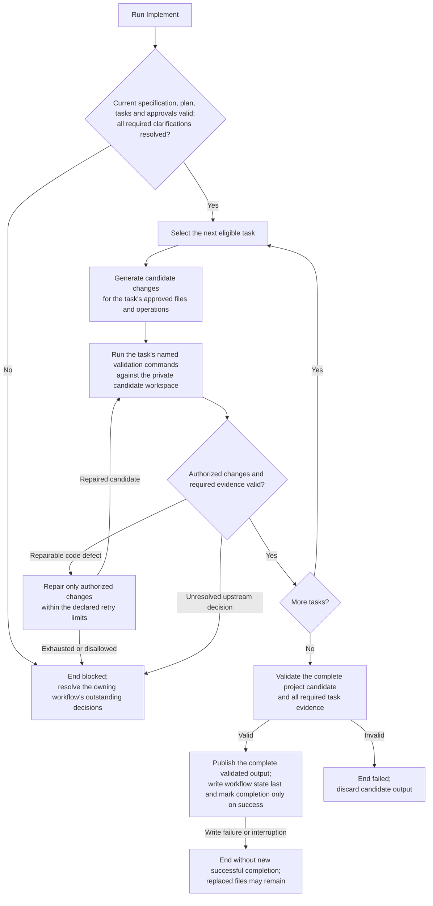

High-level execution flow for the Implement workflow.

Candidate work stays private until whole-workflow success; a failed or abandoned
run publishes no partial task completion. See
[Design §20](../design.md#20-implement-stage-design) and
[ADR 0009](../decisions/0009-atomic-workflow-execution.md).
