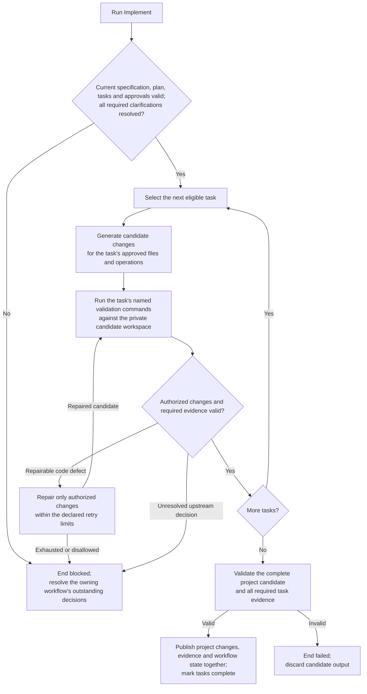

High-level execution flow for the Implement workflow.

Candidate work stays private until the whole workflow succeeds. Failure,
blocking, cancellation or interruption ends the run without publishing partial
task completion. A later invocation starts the workflow again.
