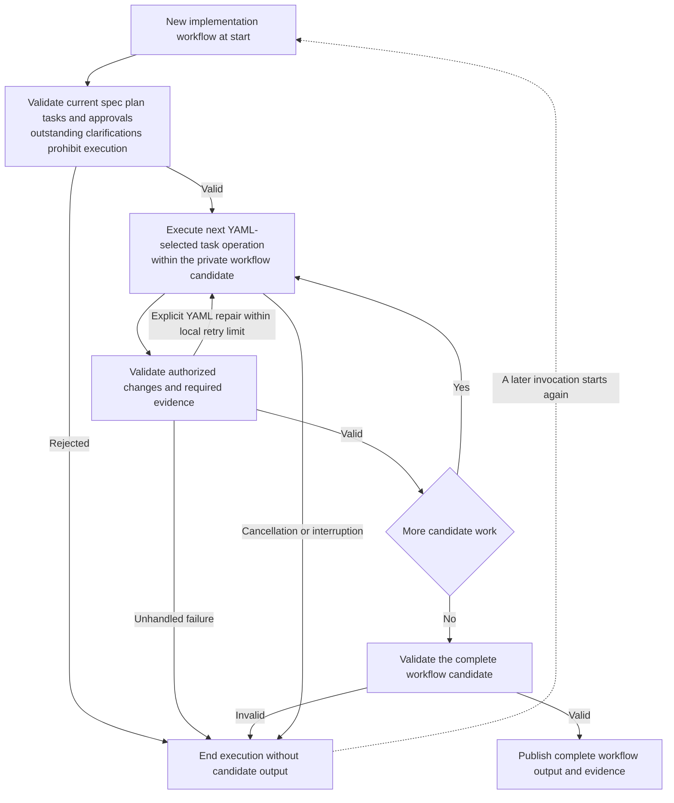

Implementation tasks remain candidate work inside one atomic workflow execution.
[ADR 0009](../decisions/0009-atomic-workflow-execution.md) prohibits independent
task commits and checkpoint recovery.

No successful sibling task is independently published. A new execution reruns
the workflow rather than resuming an operation, command or task checkpoint.
