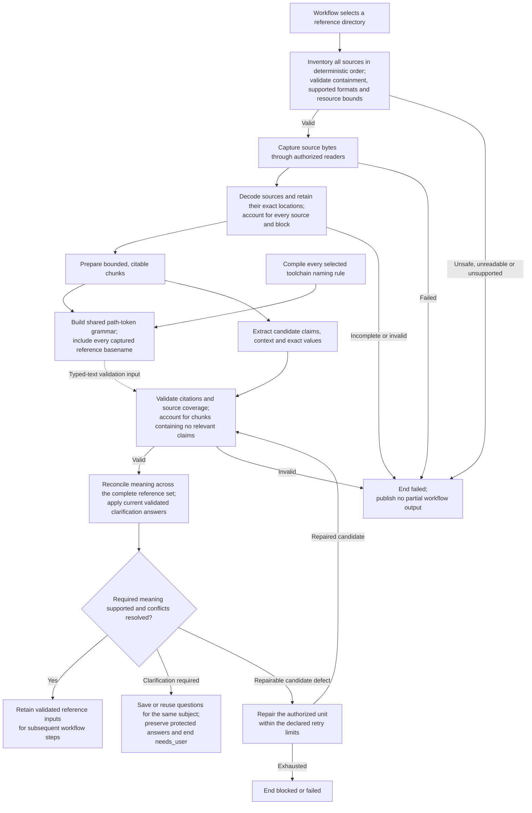

High-level flow for turning selected reference material into supported workflow inputs.

Citation checks establish where content came from. Semantic interpretation is
model-assisted and remains subject to validation and user review. Reference
candidates stay inside the current execution until whole-workflow publication;
clarifications are retained when a new run is needed.

The registered naming compiler, grammar builder and detector are implemented.
Scanning returns byte spans, not file authority or validated business text.
Typed-text/passive-literal validation and full environment/repository bindings
remain separate work. See [F0100 §3.6](../features/F0100-SpecWorkflow.md#36-shared-naming-policy-and-path-token-grammar).
