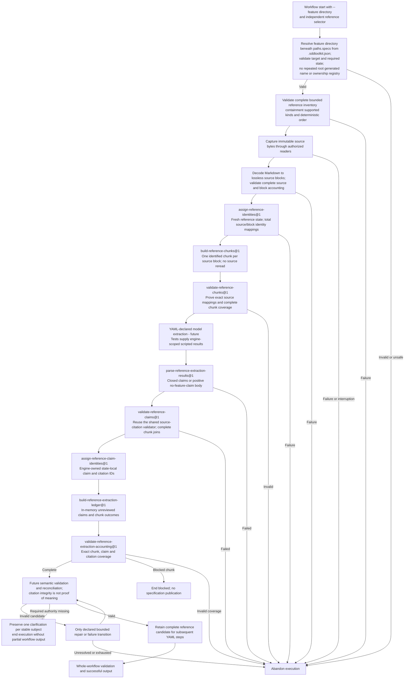

Reference ingestion within one atomic workflow execution. These are required
responsibilities, not a hidden engine route; the selected YAML declares the
operations and transitions.

Implemented: Markdown capture/accounting, citable inputs and extraction-candidate
parsing, structural validation, ID assignment and total accounting. The base
test-only ingestion YAML stops at `CITABLE`; scripted-result tests extend it
through `ACCOUNT`. Model extraction, token/passive-literal handling, semantic
reconciliation, snapshots and publication remain unfinished. See
[F0100 §3.5](../features/F0100-SpecWorkflow.md#35-extraction-candidate-accounting).

No reference-stage transaction or durable extraction checkpoint is created.
An interrupted execution is abandoned; a later invocation starts at the
workflow's beginning and reuses relevant clarification answers. See
[ADR 0009](../decisions/0009-atomic-workflow-execution.md). The supplied-directory
contract is [ADR 0010](../decisions/0010-explicit-feature-directory.md).
