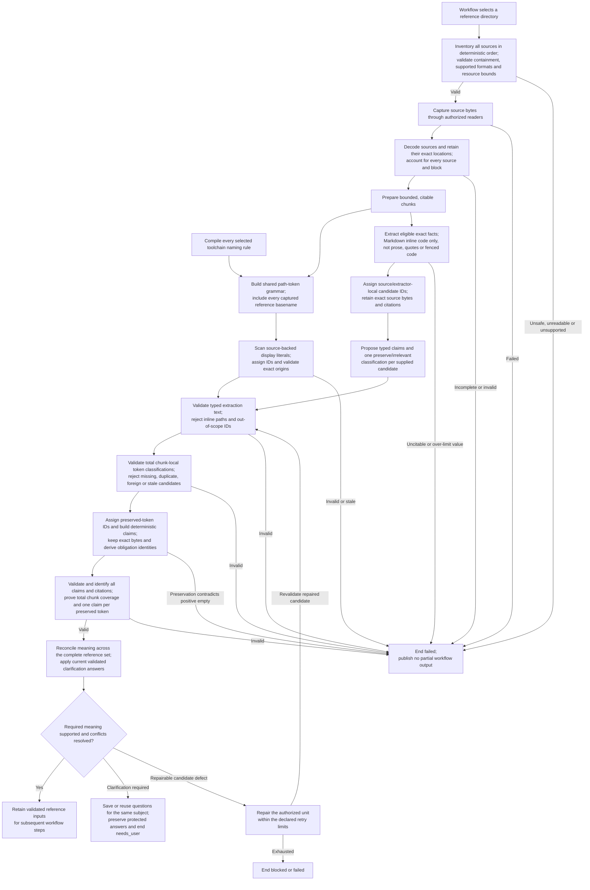

High-level flow for turning selected reference material into supported workflow inputs.

Citation checks establish where content came from. Semantic interpretation is
model-assisted and remains subject to validation and user review. Reference
candidates stay inside the current execution until whole-workflow publication;
clarifications are retained when a new run is needed.

The registered naming compiler, grammar builder and detector are implemented.
Scanning returns byte spans, not file authority or validated business text.
Typed-text/passive-literal validation is implemented for execution-local
reference candidates. Inline-code eligibility and exact-value classification,
identity and accounting are implemented with scripted results. A positive
`no_feature_claim` cannot retain a preserved-token claim. Full
environment/repository bindings, live semantic extraction, review and publication
remain separate work. See [F0100 §§3.6–3.8](../features/F0100-SpecWorkflow.md#38-exact-value-preservation).
