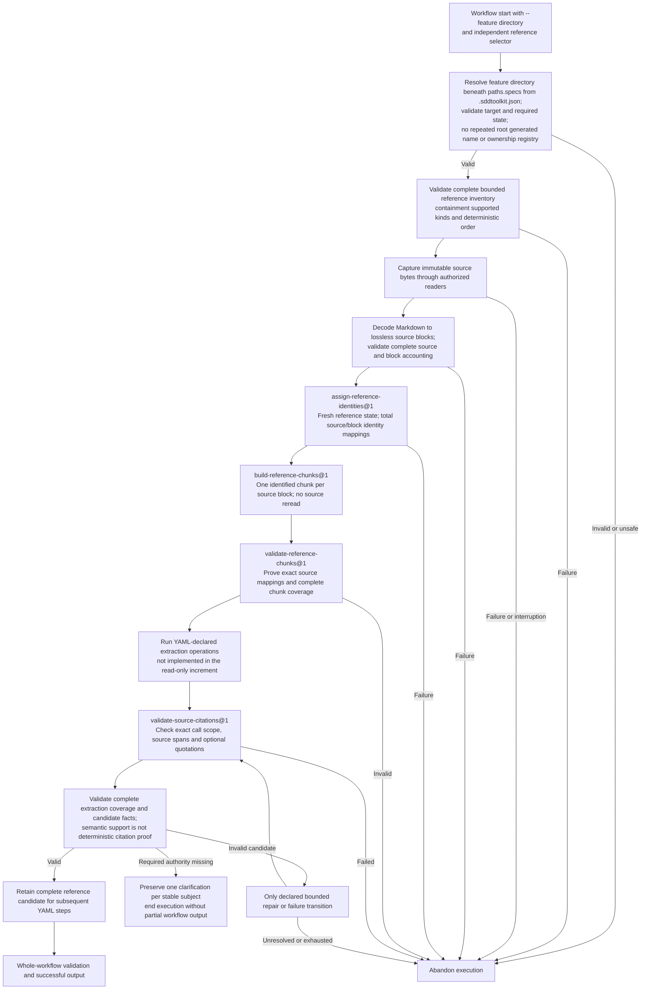

Reference ingestion within one atomic workflow execution. These are required
responsibilities, not a hidden engine route; the selected YAML declares the
operations and transitions.

Implemented: Markdown capture/accounting, reference identities, chunk preparation
and citation validation. The test-only ingestion YAML stops at `CITABLE`;
citation tests supply typed proposals. Extraction, reconciliation, persistent
snapshots and downstream output publication remain unfinished.

No reference-stage transaction or durable extraction checkpoint is created.
An interrupted execution is abandoned; a later invocation starts at the
workflow's beginning and reuses relevant clarification answers. See
[ADR 0009](../decisions/0009-atomic-workflow-execution.md). The supplied-directory
contract is [ADR 0010](../decisions/0010-explicit-feature-directory.md).
