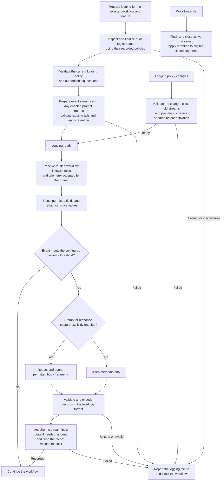

High-level flow for recording workflow activity and managing its log files.

Metadata logging follows the validated severity policy. Body capture requires
explicit opt-in, redaction and limits. Logging failures prevent further workflow
progress. Log-tail recovery repairs log records only; it never resumes workflow
execution or establishes task completion.
