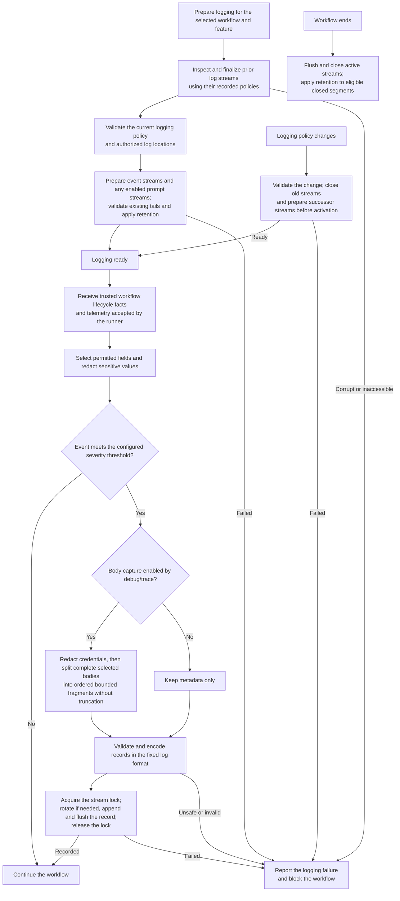

High-level flow for recording workflow activity and managing its log files.

[F0002](../features/F0002-LogService.md) and
[ADR 0018](../decisions/0018-debug-model-exchange-logging.md) own severity, debug/trace
exchange capture, redaction, limits and failure behavior.
The production invocation boundary captures requests before dispatch and available
raw responses before admission, including failed attempts. Log-tail recovery repairs log records;
it never resumes a workflow or establishes completion.
