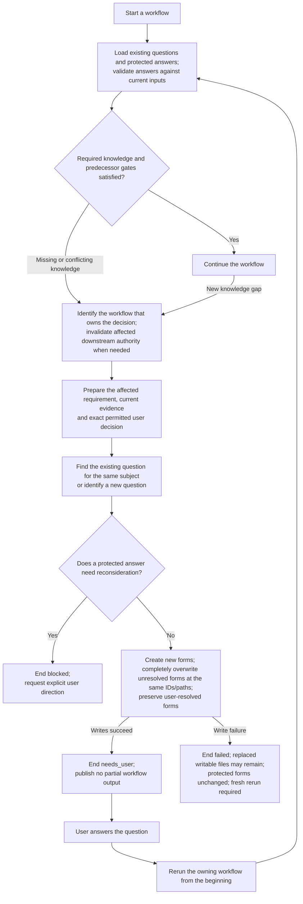

High-level lifecycle of a workflow clarification and the user's answer.

[Design §23.2](../design.md#232-workflow-reruns-and-protected-clarification-files)
owns stable subject IDs, complete replacement of unresolved forms/drafts and
byte-preserved user-closed forms. Applicable validated answers feed a fresh
execution of the owning workflow.

Question preparation follows [§12.7](../contracts/12-model-boundary.md#127-workflow-defined-model-operations)
through existing builders; it adds no summary model or multi-subject answer authority.
Open Spec clarifications stop Plan at entry; open Spec or Plan clarifications stop
Tasks at entry. Authentication/application and the new preparation work remain
pending as recorded in [H-011](../harness/02-spec-workflow.md#h-011--complete-specification-clarification-handling).
