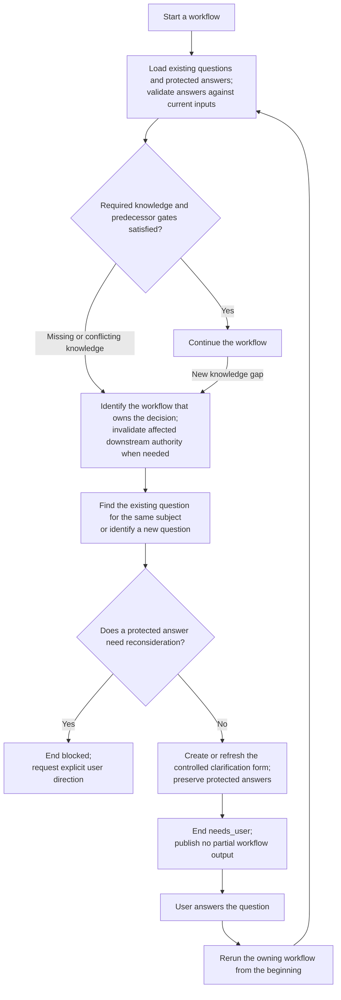

High-level lifecycle of a workflow clarification and the user's answer.

The same subject retains the same clarification identity across runs. User-closed
forms remain unchanged. Applicable validated answers become inputs to a new
execution, which regenerates and validates the owning workflow's complete output.
