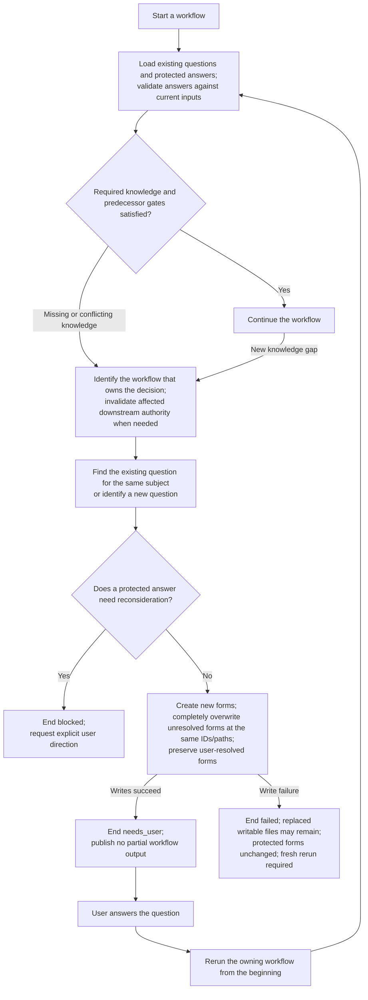

High-level lifecycle of a workflow clarification and the user's answer.

The same subject retains the same clarification identity across runs. Every
workflow completely overwrites unresolved forms from current validated state,
including open answer drafts, while user-resolved forms remain byte-for-byte
unchanged. Applicable validated answers become inputs to a new
execution, which regenerates and validates the owning workflow's complete output.
