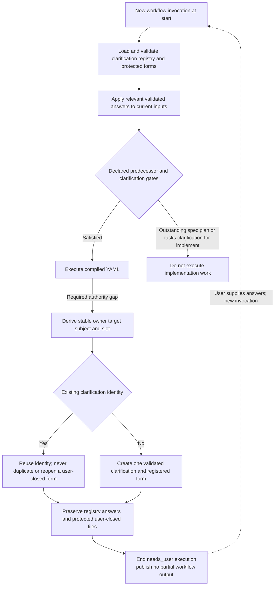

Clarifications are the explicit persistence exception to
[atomic workflow execution](../decisions/0009-atomic-workflow-execution.md).
They preserve answers, not execution continuations.

Changed wording, execution identity or authority revision does not create a
second clarification for the same subject. Invalid/stale protected answers
block rather than being overwritten. No clarification transaction, checkpoint
or saved-step resume is required.
