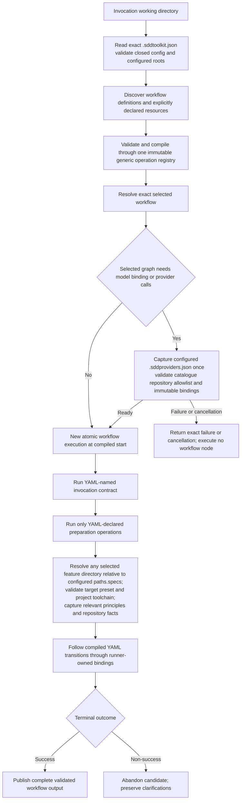

Generic startup and YAML-declared target preparation. Startup is fixed engine
machinery; workflow behavior remains in the selected compiled YAML.

For SDD feature selection, `.sddtoolkit.json`'s `paths.specs` supplies the root;
`--feature` supplies only its relative directory, with no ownership registry.
Provider calls do not require a feature-owned journal. No project/feature
transaction recovery, ledger scan or checkpoint precedes execution. Templates
remain inert; no source-tree fallback or hidden model route is introduced.
[ADR 0009](../decisions/0009-atomic-workflow-execution.md) governs fresh reruns.
