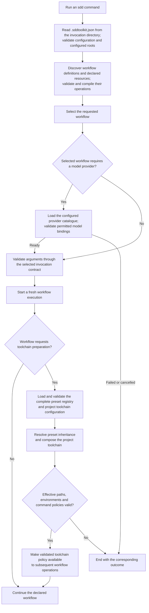

High-level startup flow and workflow-selected toolchain preparation.

The selected workflow controls when toolchain preparation occurs and which
principles or repository facts it needs. Toolchain policy governs target-project
files and commands; semantic principles provide guidance only where applicable.
Templates remain inert during ordinary workflow execution.
