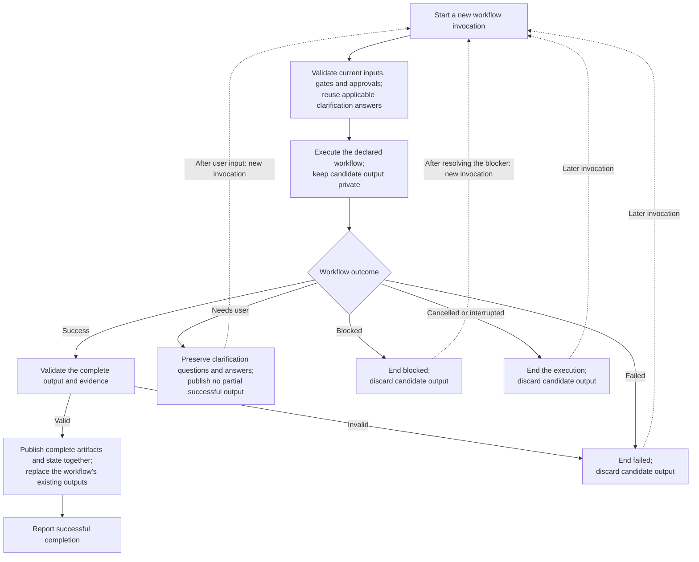

High-level lifecycle of one workflow execution.

Each invocation begins at the workflow's start. Step or task progress is not a
saved continuation. User-closed clarification files remain unchanged, and
clarification answers survive output replacement and abandoned executions.
