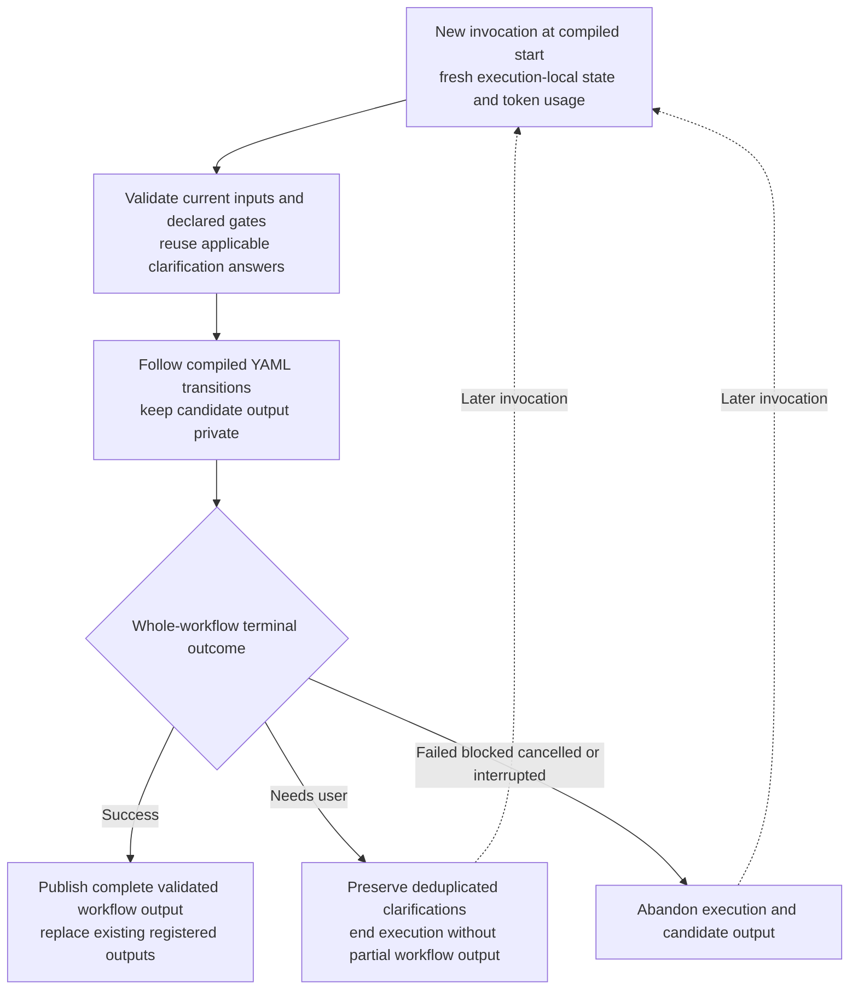

One atomic workflow execution under
[ADR 0009](../decisions/0009-atomic-workflow-execution.md).

No step/task transactions, provider journals, durable checkpoints, saved-step
continuations or recovery subsystem. User-closed clarification files remain
unchanged.
