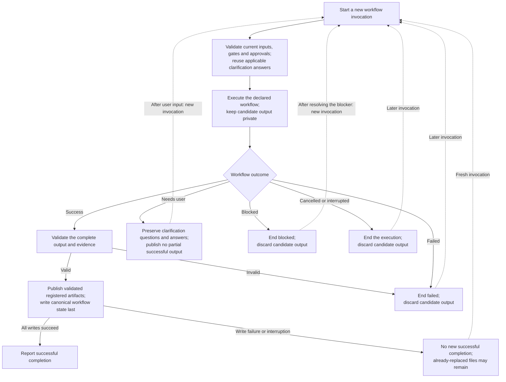

High-level lifecycle of one workflow execution.

[ADR 0009](../decisions/0009-atomic-workflow-execution.md) defines fresh execution
from `start` and whole-workflow publication. Failed writes may leave replaced
files but cannot record new success. Clarification identity/answer persistence
and user-closed byte protection follow
[§23.2](../design.md#232-workflow-reruns-and-protected-clarification-files).
