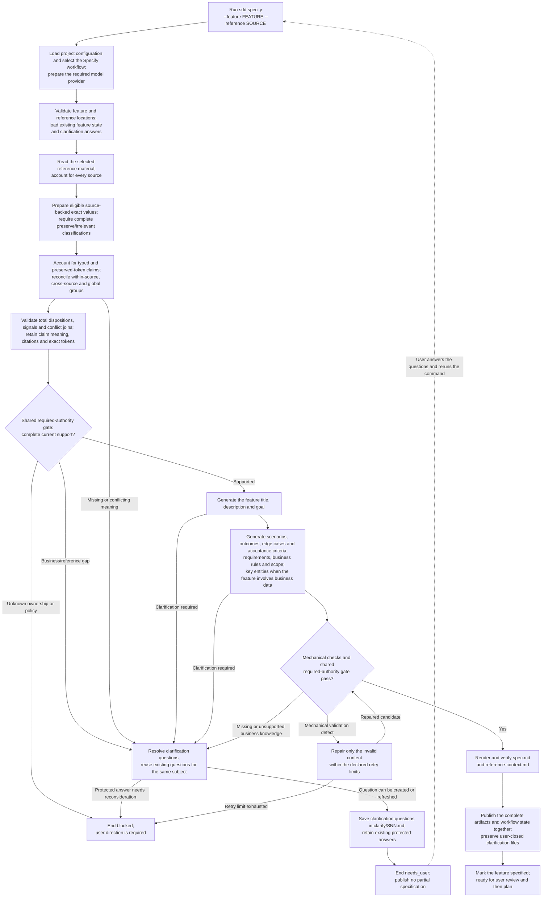

High-level execution flow for the Specify workflow.

`FEATURE` is relative to the configured `paths.specs`; `SOURCE` is relative
to `paths.references`. The feature title and requirements come from reference
material and validated answers.

Markdown inline-code interiors are exact-value candidates; prose, quoted text
and fenced code are not candidates through that extractor. Preserved values
retain original bytes and citations, without implying semantic approval or
operational authority. This in-memory boundary and scripted hierarchical
reconciliation are implemented. H-008 implements the shared required-authority
contract and Specify projection; support is not inferred from citation presence.
The same gate is rebuilt against current inputs before generation/publication,
and stale source lineage cannot authorize a consumer. Group size is explicit
in YAML; the selected reference directory defines related documents. Unresolved conflicts block;
live model iteration, answer application, clarification writing and the complete
Specify generation/publication flow shown here remain unfinished.

Every rerun starts the workflow from the beginning. A successful rerun replaces
the workflow's existing outputs at the same paths while preserving user-closed
clarification files. Failure, blocking or cancellation ends the run without
publishing a partial successful specification.
