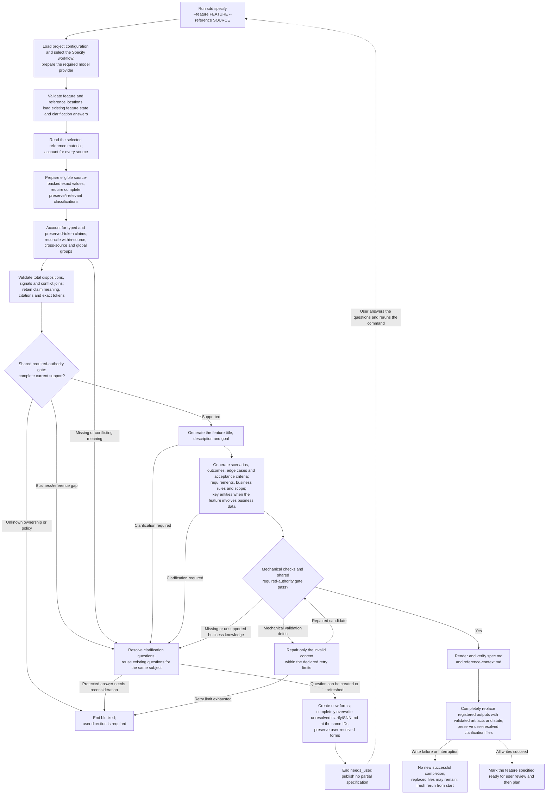
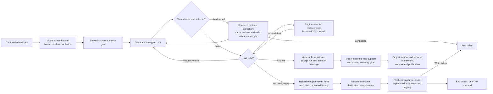

High-level execution flow for the Specify workflow.

`FEATURE` is relative to the configured `paths.specs`; `SOURCE` is relative
to `paths.references`. The feature title and requirements come from reference
material and validated answers.

Markdown inline-code interiors are exact-value candidates; prose, quoted text
and fenced code are not candidates through that extractor. Preserved values
retain original bytes and citations, without implying semantic approval or
operational authority. This in-memory boundary and scripted hierarchical
reconciliation are implemented. H-008 implements the shared required-authority
contract and Specify projection; support is not inferred from citation presence.
The same gate is rebuilt against current inputs before generation/publication,
and stale source lineage cannot authorize a consumer. Group size is explicit
in YAML; the selected reference directory defines related documents. Unresolved conflicts block;
model-connected iteration, generation, coverage and bounded repair are
implemented by H-009/H-010. H-011/H-012 now connect unit-need forms to the shared
writer and render/reparse specifications in memory. Answer application and
complete specification publication remain open; the final definition is H-013.

The current generation YAML publishes unit-need forms; successful specification
content remains in memory until the complete sidecar/state set is available:

Each model path uses the same request/provider operations and explicit cleanup.
Protocol correction keeps the original request/schema; atomic repair binds a
new request to an engine authorization. Workflow schemas and native decoding
share the closed `kind` alternatives; malformed root/nested variants fail
before request closure. Invalid, exhausted and unresolved paths
cannot reach accepted content. Model review is not deterministic semantic proof.

Every rerun starts the workflow from the beginning. A successful rerun completely
overwrites all registered replaceable outputs at the same paths. Clarification
publication completely overwrites unresolved forms at the same IDs/paths,
including open answer drafts, while user-resolved forms remain byte-for-byte
unchanged. This is the shared rule for every workflow execution. Failure,
blocking or cancellation ends the run without publishing a partial successful
specification.
If publication itself fails or is interrupted, already-replaced files may
remain; no new successful completion is recorded. A fresh rerun replaces the
output set without rollback or recovery machinery (Design §25).
