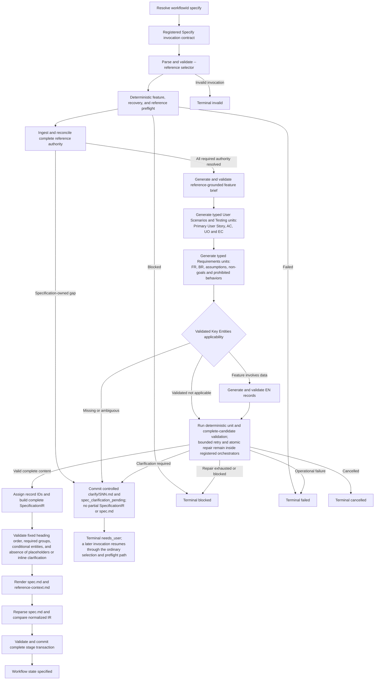

```mermaid
%% Logical Specify behavior from design Section 17.
%% Exact serializable node boundaries and registered contract IDs remain registry-owned.
flowchart TD
    A[Resolve workflowId specify] --> B[Registered Specify invocation contract]
    B --> C[Parse and validate --reference selector]
    C --> D[Deterministic feature, recovery, and reference preflight]
    D --> E[Ingest and reconcile complete reference authority]

    E -->|All required authority resolved| F[Generate and validate reference-grounded feature brief]
    E -->|Specification-owned gap| S[Commit controlled clarify/SNN.md and<br/>spec_clarification_pending; no partial SpecificationIR or spec.md]

    F --> G[Generate typed User Scenarios and Testing units:<br/>Primary User Story, AC, UO and EC]
    G --> H[Generate typed Requirements units:<br/>FR, BR, assumptions, non-goals and prohibited behaviors]
    H --> Q{Validated Key Entities applicability}
    Q -->|Feature involves data| EN[Generate and validate EN records]
    Q -->|Validated not applicable| V
    Q -->|Missing or ambiguous| S
    EN --> V[Run deterministic unit and complete-candidate validation;<br/>bounded retry and atomic repair remain inside registered orchestrators]

    V -->|Clarification required| S
    V -->|Valid complete content| I[Assign record IDs and build complete SpecificationIR]
    I --> J[Validate fixed heading order, required groups,<br/>conditional entities, and absence of placeholders or inline clarification]
    J --> K[Render spec.md and reference-context.md]
    K --> M[Reparse spec.md and compare normalized IR]
    M --> N[Validate and commit complete stage transaction]
    N --> O[Workflow state specified]

    S --> NU[Terminal needs_user;<br/>a later invocation resumes through the ordinary selection and preflight path]
    C -->|Invalid invocation| IV[Terminal invalid]
    D -->|Blocked| BL[Terminal blocked]
    D -->|Failed| FL[Terminal failed]
    V -->|Repair exhausted or blocked| BL
    V -->|Operational failure| FL
    V -->|Cancelled| CA[Terminal cancelled]
```
