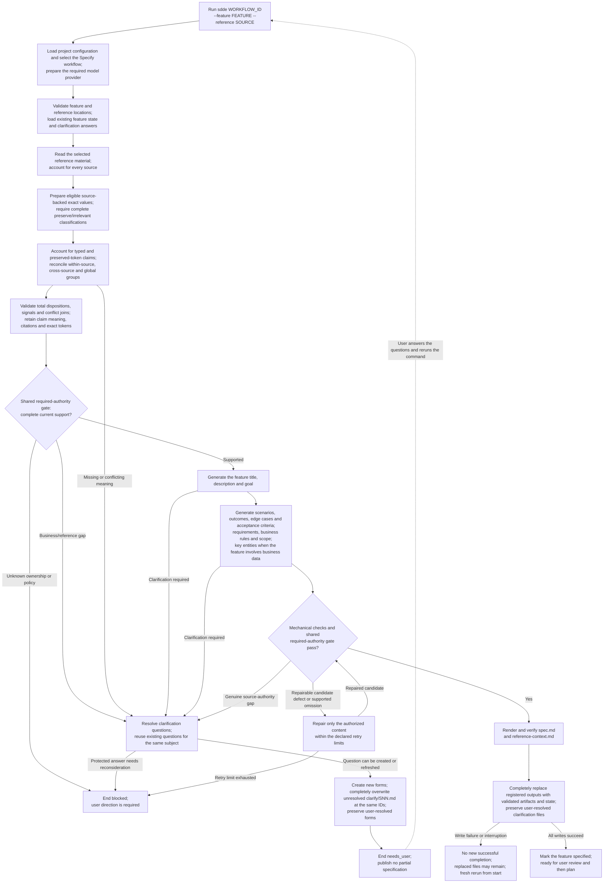
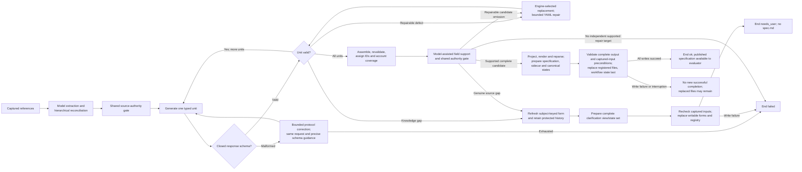

High-level execution flow for the Specify workflow.

- `FEATURE` is relative to `paths.specs`; `SOURCE` is relative to `paths.references`.
- Reference material and validated answers supply the title and requirements.
- The supplied definition declares `id: spec-generation`; filenames do not
  determine workflow identity.

[F0100](../features/F0100-SpecWorkflow.md) owns exact-value extraction,
reconciliation, shared authority gates, content and publication contracts. Its
implementation-status sections distinguish H-008–H-012 evidence and remaining
work from live completion and semantic quality.

Generation YAML publishes unit-need forms or the complete validated
specification/sidecar/state set:

- [Model request ownership](../decisions/0012-workflow-owned-model-request.md)
  keeps protocol correction on the original request/schema and binds repair to
  a fresh authorized request. Closed variants validate before request closure.
- [Design §23.2](../design.md#232-workflow-reruns-and-protected-clarification-files)
  owns rerun replacement and user-closed clarification protection.
- [Design §25](../design.md#25-atomic-workflow-execution-and-output) owns publication:
  failed writes may leave replaced files but cannot record new successful completion.
- Model-assisted review does not prove semantic correctness.
