Logical coverage of the proposed Specify workflow in
[Design Section 17](../design.md#17-specify-stage-design) and
[F0100](../features/F0100-SpecWorkflow.md). The complete executable Specify
definition remains unfinished. The groups distinguish implemented preparation
operations from planned semantic reconciliation, generation and publication.
Exact node boundaries, contract IDs and outcome transitions remain owned by
registered contracts and the selected YAML definition.

```mermaid
flowchart TD
    subgraph PREP["Implemented preparation operations"]
        A["Resolve workflowId specify"] --> P["Fixed model-provider preparation from selected graph capabilities<br/>ready or not_required continues; failure or cancellation terminates"]
        P --> B["Registered Specify invocation contract"]
        B --> C["Registered parser and validator<br/>required --feature directory and independent --reference selector"]
        C --> FD["Resolve --feature relative to paths.specs from .sddtoolkit.json;<br/>normalize validate and inspect with containment no-follow and archive exclusion;<br/>no repeated root generated name or ownership registry"]
        FD --> C1["normalize-reference-selector@1<br/>Shared pinned NFC; separators and literal dots"]
        C1 --> C2["validate-reference-selector@1<br/>Lexical safety and bounds"]
        C2 --> C3["inspect-reference-directory@1<br/>Bound root identity; no-follow readable directory"]
        C3 --> D["Resolve fixed artifact paths; capture clarification state and forms;<br/>strict parse and structural/form validation;<br/>read-only: no file or state mutation"]
        D --> CL["Retain exact closed bytes and distinguish submitted from recorded answers;<br/>missing changed stale or malformed forms fail without writes"]
        CL --> RI["inventory-reference-sources@1<br/>validate-reference-inventory@1<br/>Bounded ordered inventory; containment and supported-source checks"]
        RI --> RC["capture-reference-sources@1<br/>Capture immutable source bytes through no-follow readers"]
        RC --> RD["decode-reference-markdown@1<br/>validate-reference-accounting@1<br/>Decode Markdown and require complete source and block accounting"]
        RD --> RID["assign-reference-identities@1<br/>Assign engine-owned corpus source and block identities"]
        RID --> RCH["build-reference-chunks@1<br/>validate-reference-chunks@1<br/>Retain validated citable inputs in execution memory"]
    end

    RCH --> E

    subgraph SPEC["Planned Specify composition: reconciliation generation and publication"]
        E["Extract reference claims and reconcile complete authority;<br/>validate answer applicability and authenticate new responses before acceptance"]
        E -->|All required authority resolved| F["Generate and validate reference-grounded feature brief"]
        E -->|Specification-owned gap or protected answer needs reconsideration| NEED

        F -->|Validated content| G["Generate and validate User Scenarios and Testing units:<br/>Primary User Story, AC, UO and EC"]
        G -->|Validated content| H["Generate and validate Requirements units:<br/>FR, BR, assumptions, non-goals and prohibited behaviors"]
        H -->|Validated content| Q{"Validated Key Entities applicability"}
        Q -->|Feature involves data| EN["Generate and validate EN records"]
        Q -->|Validated not applicable| V
        Q -->|Missing or ambiguous| NEED
        F -->|Clarification required| NEED
        G -->|Clarification required| NEED
        H -->|Clarification required| NEED
        EN -->|Clarification required| NEED
        EN -->|Validated content| V["Reconcile complete candidate authority and run deterministic validation;<br/>mechanical defects use YAML-declared bounded retry and atomic repair;<br/>revalidate impacted units and the full candidate"]

        V -->|Clarification required| NEED
        NEED["Resolve stable specification-clarification subject;<br/>deduplicate against current registry and protected answers"]
        NEED -->|Protected answer requires reconsideration| CB["Block for explicit user direction;<br/>do not overwrite the form or allocate a duplicate clarification"]
        NEED -->|Clarification can be created or refreshed| S["Create or refresh only unprotected clarify/SNN.md forms;<br/>retain protected forms in the complete view set and commit spec_clarification_pending;<br/>no new partial SpecificationIR or spec.md"]
        S --> NU["Terminal needs_user; preserve clarifications and end execution;<br/>a later invocation starts the entire workflow again"]

        V -->|Valid complete content| I["Assign record IDs and build complete SpecificationIR"]
        I --> J["Validate fixed heading order, required groups,<br/>conditional entities, and absence of placeholders or inline clarification"]
        J --> K["Render spec.md and reference-context.md"]
        K --> M["Reparse spec.md and compare normalized IR;<br/>verify reference-context.md against canonical rendering"]
        M --> N["Validate and publish the complete artifact and state set atomically;<br/>recheck containment and user-closed clarification protection before writes;<br/>reruns MUST overwrite existing Specify outputs at the same registered paths;<br/>no separate overwrite approval; never clear the feature directory"]
        N --> O["Workflow state specified after successful publication"]
    end

    C -->|Rejected invocation| PF["Terminal failed; no feature or artifact writes"]
    FD -->|Invalid or unsafe| PF
    C1 -->|Failed| PF
    C2 -->|Failed| PF
    C3 -->|Failed| PF
    D -->|Failed| PF
    RI -->|Failed| PF
    RC -->|Failed| PF
    RD -->|Failed| PF
    RID -->|Failed| PF
    RCH -->|Failed| PF
    CB --> BL["Terminal blocked"]
    V -->|Repair exhausted or blocked| BL
    V -->|Operational failure| FL["Terminal failed"]
    V -->|Cancelled| CA["Terminal cancelled"]
```

The [reference-ingestion fixture](../../src/test_fixtures/reference-ingestion.workflow.yaml)
currently ends after chunk validation. The
[source-citation validator](../../src/actions/reference/validate_source_citations.zig)
is also registered for typed citation proposals. Semantic extraction,
reconciliation, response acceptance, clarification publication and complete
Specify output remain planned.

Each generation group includes authority reconciliation before every model
operation, unit validation and declared mechanical repair. Missing domain
knowledge takes the shared clarification path. Every retry-capable operation
declares its own `retry-limit`. The diagram summarizes logical responsibilities;
the selected YAML must map every registered outcome, including failure and
cancellation, and success requires complete validation and publication.
