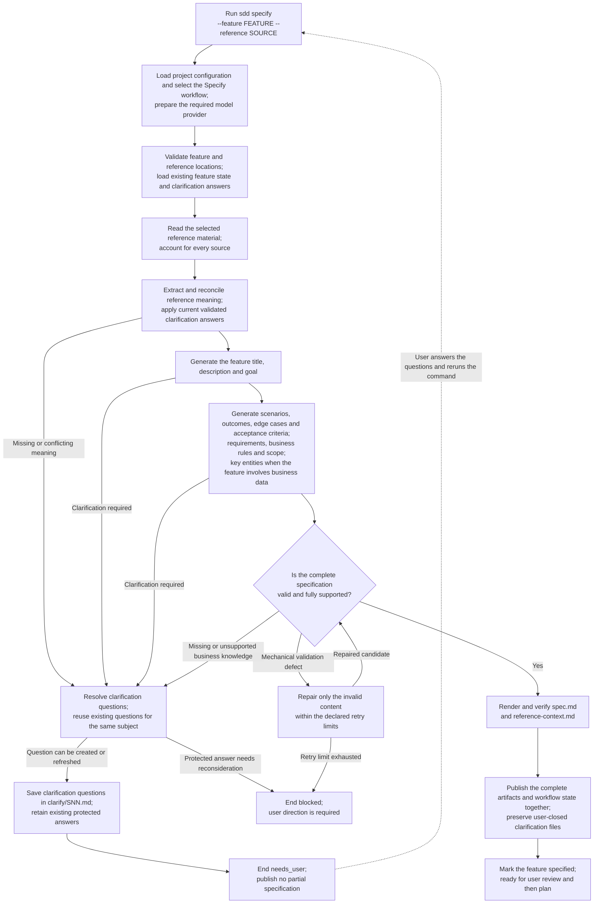

High-level execution flow for the Specify workflow, following
[Design Section 17](../design.md#17-specify-stage-design) and
[F0100](../features/F0100-SpecWorkflow.md).

`FEATURE` is relative to the configured `paths.specs`; `SOURCE` is relative
to `paths.references`. The feature title and requirements come from reference
material and validated answers.

Every rerun starts the workflow from the beginning. A successful rerun replaces
the workflow's existing outputs at the same paths while preserving user-closed
clarification files. Failure, blocking or cancellation ends the run without
publishing a partial successful specification.

Within reference understanding, native operations now parse scripted extraction
results, validate citation integrity, assign claim/citation IDs and require
complete chunk accounting. They produce unreviewed in-memory candidates, not
reconciled authority. Model extraction, semantic reconciliation and the later
generation/publication stages remain unfinished
([F0100 §3.5](../features/F0100-SpecWorkflow.md#35-extraction-candidate-accounting)).
