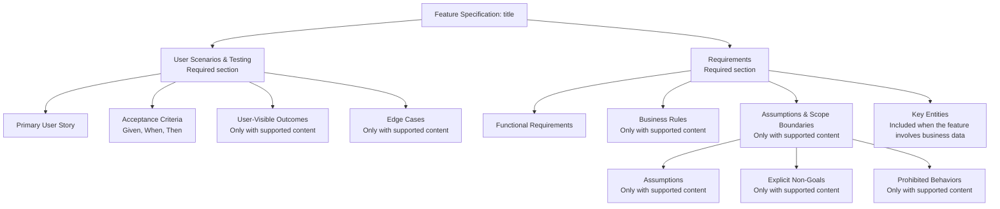

High-level structure of the generated specification document.

[F0100 §5](../features/F0100-SpecWorkflow.md#5-specmd-projection-contract)
owns hierarchy, record IDs, mandatory content and optional-section omission.
Questions belong in `clarify/SNN.md`; technical detail belongs in
`reference-context.md`. Structure alone does not prove semantic quality.
