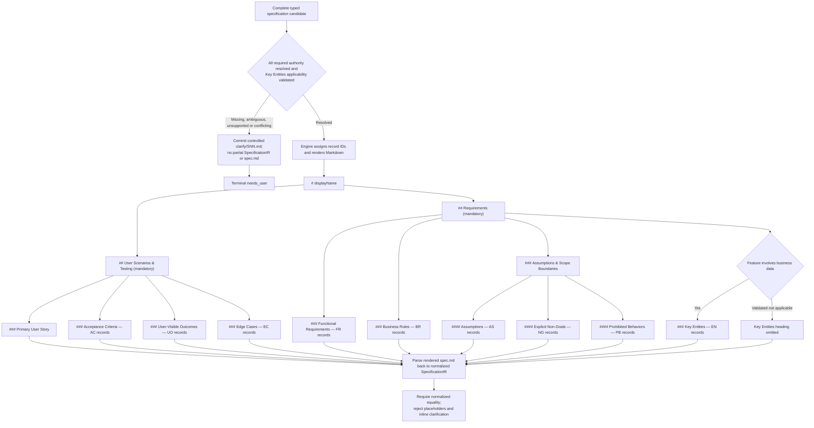

```mermaid
%% Canonical business-facing spec.md hierarchy owned by F0100.
flowchart TB
    C[Complete typed specification candidate] --> V{All required authority resolved and<br/>Key Entities applicability validated}
    V -->|Missing, ambiguous, unsupported or conflicting| S[Commit controlled clarify/SNN.md;<br/>no partial SpecificationIR or spec.md]
    S --> N[Terminal needs_user]
    V -->|Resolved| R[Engine assigns record IDs and renders Markdown]

    R --> TITLE["# displayName"]

    TITLE --> UST["## User Scenarios & Testing (mandatory)"]
    UST --> STORY["### Primary User Story"]
    UST --> AC["### Acceptance Criteria — AC records"]
    UST --> UO["### User-Visible Outcomes — UO records"]
    UST --> EC["### Edge Cases — EC records"]

    TITLE --> REQ["## Requirements (mandatory)"]
    REQ --> FR["### Functional Requirements — FR records"]
    REQ --> BR["### Business Rules — BR records"]
    REQ --> SCOPE["### Assumptions & Scope Boundaries"]
    SCOPE --> AS["#### Assumptions — AS records"]
    SCOPE --> NG["#### Explicit Non-Goals — NG records"]
    SCOPE --> PB["#### Prohibited Behaviors — PB records"]
    REQ --> DATA{Feature involves business data}
    DATA -->|Yes| EN["### Key Entities — EN records"]
    DATA -->|Validated not applicable| OMIT[Key Entities heading omitted]

    STORY --> P[Parse rendered spec.md back to normalized SpecificationIR]
    AC --> P
    UO --> P
    EC --> P
    FR --> P
    BR --> P
    AS --> P
    NG --> P
    PB --> P
    EN --> P
    OMIT --> P
    P --> E[Require normalized equality;<br/>reject placeholders and inline clarification]
```
