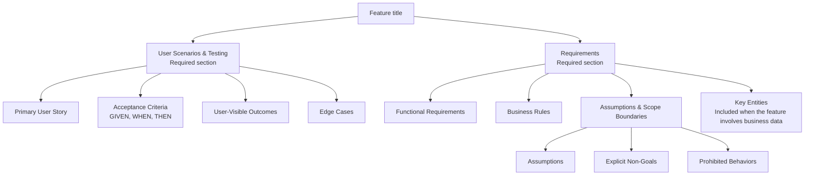

High-level structure of the generated specification document.

The engine renders these sections in order and assigns record identities.
Required content must be supported before publication. Missing knowledge goes
into clarification forms. Technical reference context is recorded separately
in `reference-context.md`.
