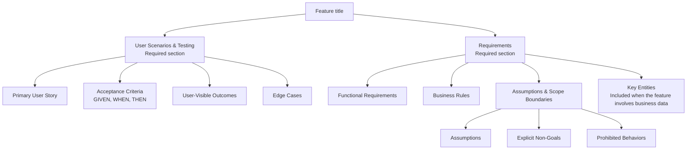

High-level structure of the generated specification document.

The engine renders [F0100 §5.1's hierarchy](../features/F0100-SpecWorkflow.md#51-ownership-and-hierarchy)
in order and assigns record identities. A required section does not imply a
minimum population for each child collection. Missing required knowledge goes
into `clarify/SNN.md`, never an `Open Questions` specification section.
Technical reference context is recorded separately in `reference-context.md`.
This diagram describes structure, not deterministic proof of semantic quality;
the native content/view contract is recorded in F0100 §5.6.
