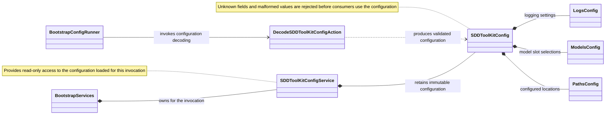

Main responsibilities and relationships for project configuration.

Startup reads the invocation's `.sddtoolkit.json`. Dedicated validators resolve
the logging, model and path policies from the same immutable configuration.
