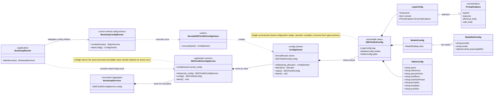

```mermaid
classDiagram
    direction LR

    class DecodeSDDToolKitConfigAction {
        <<action>>
        +execute(bytes) ConfigOwned
    }

    class BootstrapRunner {
        <<application>>
        +takeServices() BootstrapServices
    }

    class BootstrapConfigRunner {
        <<runner-owned config actions>>
        +invokeDecode() StepOutcome
        +takeConfig() ConfigOwned
    }

    class BootstrapServices {
        <<invocation aggregate>>
        +SDDToolKitConfigService config
    }

    class SDDToolKitConfigService {
        <<application service>>
        -ConfigOwned owned_config
        +init(owned_config) SDDToolKitConfigService
        +config() SDDToolKitConfig
        +deinit() void
    }

    class ConfigOwned {
        <<config.Owned>>
        -ArenaAllocator arena
        -SDDToolKitConfig config
        +init(backing_allocator) ConfigOwned
        +allocator() Allocator
        +value() SDDToolKitConfig
        +deinit() void
    }

    class SDDToolKitConfig {
        <<immutable value>>
        +LogsConfig logs
        +ModelsConfig models
        +PathsConfig paths
    }

    class LogsConfig {
        +string level
        +bool console
        +PromptCapture list promptCapture
    }

    class PromptCapture {
        <<enumeration>>
        request
        response
        reference_body
        code_body
    }

    class ModelsConfig {
        +ModelSlotMap slots
    }

    class ModelSlotConfig {
        +string provider
        +string model
        +optional string reasoningEffort
    }

    class PathsConfig {
        +string specs
        +string references
        +string specsArchive
        +string workflows
        +string toolchainPreset
        +string principles
        +string templates
        +string providers
    }

    BootstrapRunner --> BootstrapConfigRunner : delegates config children
    BootstrapConfigRunner ..> DecodeSDDToolKitConfigAction : executes once
    DecodeSDDToolKitConfigAction ..> ConfigOwned : creates
    BootstrapRunner ..> SDDToolKitConfigService : transfers takeConfig result
    BootstrapServices *-- SDDToolKitConfigService : owns for invocation
    SDDToolKitConfigService *-- ConfigOwned : owns by value
    ConfigOwned *-- SDDToolKitConfig : arena-owned
    SDDToolKitConfig *-- LogsConfig
    SDDToolKitConfig *-- ModelsConfig
    SDDToolKitConfig *-- PathsConfig
    LogsConfig o-- "0..4" PromptCapture : selectors
    ModelsConfig o-- "0..*" ModelSlotConfig : slot values

    note for SDDToolKitConfigService "config() returns the same borrowed immutable value; deinit() releases its arena once"
    note for SDDToolKitConfig "Single unversioned closed configuration shape; semantic compilers consume their typed sections"
```
