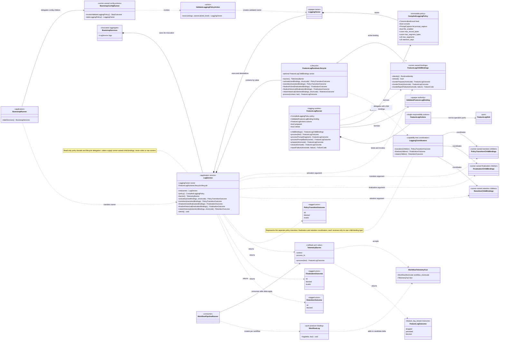

```mermaid
classDiagram
    direction LR

    class ValidateLoggingPolicyAction {
        <<action>>
        +execute(logs, canonicalized_level) LoggingOwner
    }

    class BootstrapRunner {
        <<application>>
        +takeServices() BootstrapServices
    }

    class BootstrapConfigRunner {
        <<runner-owned config actions>>
        +invokeValidateLoggingPolicy() StepOutcome
        +takeLoggingPolicy() LoggingOwner
    }

    class BootstrapServices {
        <<invocation aggregate>>
        +LogService logs
    }

    class LogService {
        <<application service>>
        -LoggingOwner owner
        -FeatureLogRuntimeLifecycle lifecycle
        +init(owner) LogService
        +policy() CompiledLoggingPolicy
        +barrier() TelemetryBarrier
        +activate(activeBindings, shortcode) PolicyTransitionOutcome
        +transition(transitionBindings) PolicyTransitionOutcome
        +finalizeActive(finalizationBindings) FinalizationOutcome
        +finalizeHistorical(finalizationBindings) FinalizationOutcome
        +retainHistorical(retentionBindings, shortcode) RetentionOutcome
        +deinit() void
    }

    class LoggingOwner {
        <<opaque owner>>
    }

    class CompiledLoggingPolicy {
        <<immutable policy>>
        +CanonicalizedLevel level
        +bool console
        +PromptCapture list prompt_capture
        +bool file_enabled
        +usize max_record_bytes
        +usize max_segment_bytes
        +u8 max_segments
        +u8 retention_days
    }

    class FeatureLogRuntimeLifecycle {
        <<Lifecycle>>
        -optional FeatureLogChildBindings active
        +barrier() TelemetryBarrier
        +activate(nextBindings, shortcode) PolicyTransitionOutcome
        +transition(transitionBindings) PolicyTransitionOutcome
        +finalizeActive(finalizationBindings) FinalizationOutcome
        +finalizeHistorical(finalizationBindings) FinalizationOutcome
        +retainHistorical(retentionBindings, shortcode) RetentionOutcome
        -process(context, fact) FeatureLogOutcome
    }

    class FeatureLogChildBindings {
        <<runner-owned bindings>>
        +identity() RuntimeIdentity
        +retired() bool
        +invokePrepare(shortcode) FeatureLogOutcome
        +invokeClose(shortcode) FeatureLogOutcome
        +invokeReportFailure(shortcode, failure) FailureCode
    }

    class PolicyTransitionChildBindings {
        <<runner-owned transition children>>
    }

    class FinalizationChildBindings {
        <<runner-owned finalization children>>
    }

    class RetentionChildBindings {
        <<runner-owned retention children>>
    }

    class LoggingCoordinators {
        <<capability-free coordination>>
        +transition(children) PolicyTransitionOutcome
        +finalize(children) FinalizationOutcome
        +retain(children) RetentionOutcome
    }

    class FeatureLogRunner {
        <<logging runtime>>
        +CompiledLoggingPolicy policy
        +ValidatedFeatureLogBinding binding
        +FeatureLogActions actions
        +bool prepared
        +bool retired
        +childBindings() FeatureLogChildBindings
        +process(fact) FeatureLogOutcome
        +processPrompt(fragment) FeatureLogOutcome
        +processPromptBatch(owner) FeatureLogOutcome
        +prepare(shortcode) FeatureLogOutcome
        +close(shortcode) FeatureLogOutcome
        +reportFailure(shortcode, failure) FailureCode
    }

    class TelemetryBarrier {
        <<callback port value>>
        -context
        -process_fn
        +process(fact) FeatureLogOutcome
    }

    class WorkflowPipelineRunner {
        <<consumer>>
    }

    class WorkflowLog {
        <<pure producer binding>>
        +log(delta, fact) void
    }

    class WorkflowTelemetryFact {
        +WorkflowShortcode workflow_shortcode
        +TelemetryFact fact
    }

    class FeatureLogSink {
        <<port>>
    }

    class ValidatedFeatureLogBinding {
        <<opaque authority>>
    }

    class FeatureLogActions {
        <<single-responsibility actions>>
    }

    class FeatureLogOutcome {
        <<feature_log_stream.Outcome>>
        dropped
        persisted
        blocked
    }

    class PolicyTransitionOutcome {
        <<tagged union>>
        ok
        blocked
        invalid
    }

    class FinalizationOutcome {
        <<tagged union>>
        ok
        blocked
        invalid
    }

    class RetentionOutcome {
        <<tagged union>>
        ok
        blocked
    }

    ValidateLoggingPolicyAction ..> LoggingOwner : creates validated owner
    BootstrapRunner --> BootstrapConfigRunner : delegates config children
    BootstrapConfigRunner ..> ValidateLoggingPolicyAction : invokes
    BootstrapRunner ..> LogService : transfers owner
    BootstrapServices *-- LogService : owns for invocation
    LogService *-- LoggingOwner : owns and deinitializes
    LoggingOwner *-- CompiledLoggingPolicy : stores
    LogService *-- FeatureLogRuntimeLifecycle : contains by value
    FeatureLogRuntimeLifecycle o-- "0..1" FeatureLogChildBindings : active binding
    FeatureLogRunner ..> FeatureLogChildBindings : exposes
    LogService ..> FeatureLogChildBindings : activation argument
    LogService ..> PolicyTransitionChildBindings : transition argument
    LogService ..> FinalizationChildBindings : finalization argument
    LogService ..> RetentionChildBindings : retention argument
    FeatureLogRuntimeLifecycle ..> LoggingCoordinators : delegates with child bindings
    LoggingCoordinators --> PolicyTransitionChildBindings : coordinates
    LoggingCoordinators --> FinalizationChildBindings : coordinates
    LoggingCoordinators --> RetentionChildBindings : coordinates
    LogService ..> TelemetryBarrier : returns
    TelemetryBarrier ..> WorkflowTelemetryFact : accepts
    WorkflowPipelineRunner --> TelemetryBarrier : consumes after delta apply
    WorkflowPipelineRunner ..> WorkflowLog : creates per workflow
    WorkflowLog ..> WorkflowTelemetryFact : adds to candidate delta
    FeatureLogRunner --> CompiledLoggingPolicy : borrows
    FeatureLogRunner --> ValidatedFeatureLogBinding : borrows
    FeatureLogRunner *-- FeatureLogActions : binds and invokes
    FeatureLogActions --> FeatureLogSink : narrow operation ports
    TelemetryBarrier ..> FeatureLogOutcome : returns
    LogService ..> PolicyTransitionOutcome : returns
    LogService ..> FinalizationOutcome : returns
    LogService ..> RetentionOutcome : returns

    note for LogService "Read-only policy facade and lifecycle delegation; callers supply runner-owned child bindings, never sinks or raw runners"
    note for LoggingCoordinators "Represents the separate policy-transition, finalization and retention coordinators; each receives only its own child-binding type"
```
