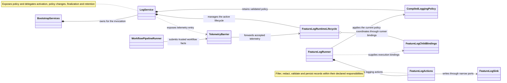

Main responsibilities and relationships for workflow logging.

Workflow code contributes telemetry facts. The logging runtime owns safe
recording and stream management. A logging failure blocks further workflow
progress; logs do not establish workflow authority or completion.
