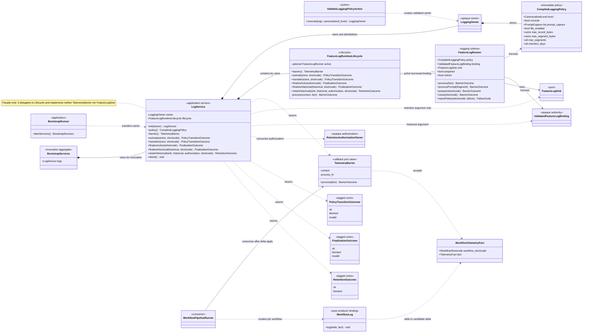

```mermaid
classDiagram
    direction LR

    class ValidateLoggingPolicyAction {
        <<action>>
        +execute(logs, canonicalized_level) LoggingOwner
    }

    class BootstrapRunner {
        <<application>>
        +takeServices() BootstrapServices
    }

    class BootstrapServices {
        <<invocation aggregate>>
        +LogService logs
    }

    class LogService {
        <<application service>>
        -LoggingOwner owner
        -FeatureLogRuntimeLifecycle lifecycle
        +init(owner) LogService
        +policy() CompiledLoggingPolicy
        +barrier() TelemetryBarrier
        +activate(active, shortcode) PolicyTransitionOutcome
        +transition(next, shortcode) PolicyTransitionOutcome
        +finalizeActive(shortcode) FinalizationOutcome
        +finalizeHistorical(historical, shortcode) FinalizationOutcome
        +retainHistorical(sink, historical, authorization, shortcode) RetentionOutcome
        +deinit() void
    }

    class LoggingOwner {
        <<opaque owner>>
    }

    class CompiledLoggingPolicy {
        <<immutable policy>>
        +CanonicalizedLevel level
        +bool console
        +PromptCapture list prompt_capture
        +bool file_enabled
        +usize max_record_bytes
        +usize max_segment_bytes
        +u8 max_segments
        +u8 retention_days
    }

    class FeatureLogRuntimeLifecycle {
        <<Lifecycle>>
        -optional FeatureLogRunner active
        +barrier() TelemetryBarrier
        +activate(next, shortcode) PolicyTransitionOutcome
        +transition(next, shortcode) PolicyTransitionOutcome
        +finalizeActive(shortcode) FinalizationOutcome
        +finalizeHistorical(historical, shortcode) FinalizationOutcome
        +retainHistorical(sink, historical, authorization, shortcode) RetentionOutcome
        -process(context, fact) BarrierOutcome
    }

    class FeatureLogRunner {
        <<logging runtime>>
        +CompiledLoggingPolicy policy
        +ValidatedFeatureLogBinding binding
        +FeatureLogSink sink
        +bool prepared
        +bool retired
        +process(fact) BarrierOutcome
        +processPrompt(fragment) BarrierOutcome
        +prepare(shortcode) BarrierOutcome
        +close(shortcode) BarrierOutcome
        +reportFailure(shortcode, failure) FailureCode
    }

    class TelemetryBarrier {
        <<callback port value>>
        -context
        -process_fn
        +process(fact) BarrierOutcome
    }

    class WorkflowPipelineRunner {
        <<consumer>>
    }

    class WorkflowLog {
        <<pure producer binding>>
        +log(delta, fact) void
    }

    class WorkflowTelemetryFact {
        +WorkflowShortcode workflow_shortcode
        +TelemetryFact fact
    }

    class FeatureLogSink {
        <<port>>
    }

    class ValidatedFeatureLogBinding {
        <<opaque authority>>
    }

    class RetentionAuthorizationOwner {
        <<opaque authorization>>
    }

    class PolicyTransitionOutcome {
        <<tagged union>>
        ok
        blocked
        invalid
    }

    class FinalizationOutcome {
        <<tagged union>>
        ok
        blocked
        invalid
    }

    class RetentionOutcome {
        <<tagged union>>
        ok
        blocked
    }

    ValidateLoggingPolicyAction ..> LoggingOwner : creates validated owner
    BootstrapRunner ..> LogService : transfers owner
    BootstrapServices *-- LogService : owns for invocation
    LogService *-- LoggingOwner : owns and deinitializes
    LoggingOwner *-- CompiledLoggingPolicy : stores
    LogService *-- FeatureLogRuntimeLifecycle : contains by value
    FeatureLogRuntimeLifecycle o-- "0..1" FeatureLogRunner : active borrowed binding
    LogService ..> TelemetryBarrier : returns
    TelemetryBarrier ..> WorkflowTelemetryFact : accepts
    WorkflowPipelineRunner --> TelemetryBarrier : consumes after delta apply
    WorkflowPipelineRunner ..> WorkflowLog : creates per workflow
    WorkflowLog ..> WorkflowTelemetryFact : adds to candidate delta
    FeatureLogRunner --> CompiledLoggingPolicy : borrows
    FeatureLogRunner --> ValidatedFeatureLogBinding : borrows
    FeatureLogRunner --> FeatureLogSink : uses
    LogService ..> FeatureLogSink : retention argument only
    LogService ..> ValidatedFeatureLogBinding : historical argument
    LogService ..> RetentionAuthorizationOwner : consumes authorization
    LogService ..> PolicyTransitionOutcome : returns
    LogService ..> FinalizationOutcome : returns
    LogService ..> RetentionOutcome : returns

    note for LogService "Facade only: it delegates to Lifecycle and implements neither TelemetryBarrier nor FeatureLogSink"
```
