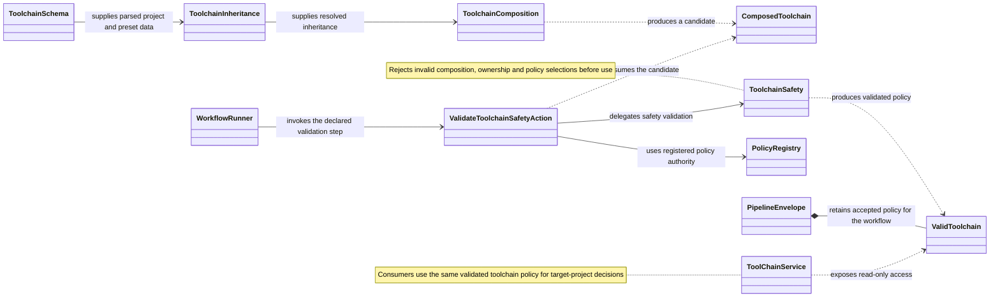

Main responsibilities and relationships for target-project toolchain policy.

Separate workflow-selected actions perform capture, parsing, inheritance,
composition and validation. The diagram shows their data relationships.
The service reads validated results; it does not load or combine toolchain files.
