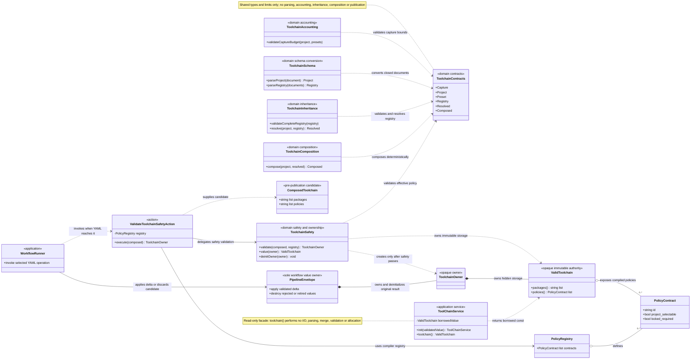

Fixed startup loads configuration, roots, and workflow definitions only. The
selected YAML graph explicitly orders the separate capture, inventory, parsing,
schema-validation, inheritance, composition, and safety operations. A workflow
without those operations never reads toolchain documents.
