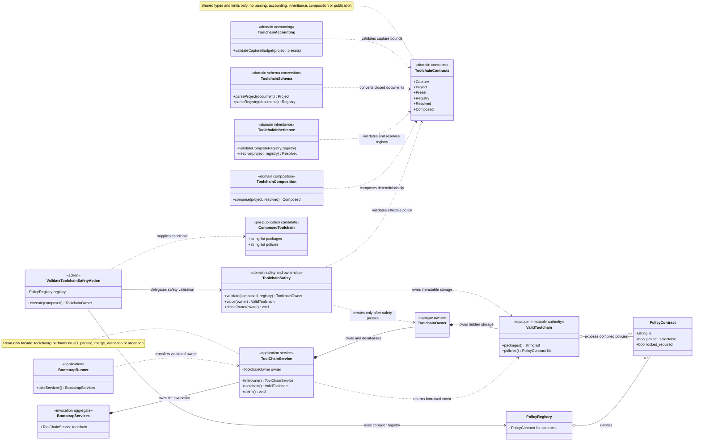

```mermaid
classDiagram
    direction LR

    class ToolchainContracts {
        <<domain contracts>>
        +Capture
        +Project
        +Preset
        +Registry
        +Resolved
        +Composed
    }

    class ToolchainAccounting {
        <<domain accounting>>
        +validateCaptureBudget(project, presets)
    }

    class ToolchainSchema {
        <<domain schema conversion>>
        +parseProject(document) Project
        +parseRegistry(documents) Registry
    }

    class ToolchainInheritance {
        <<domain inheritance>>
        +validateCompleteRegistry(registry)
        +resolve(project, registry) Resolved
    }

    class ToolchainComposition {
        <<domain composition>>
        +compose(project, resolved) Composed
    }

    class ToolchainSafety {
        <<domain safety and ownership>>
        +validate(composed, registry) ToolchainOwner
        +value(owner) ValidToolchain
        +deinitOwner(owner) void
    }

    class ValidateToolchainSafetyAction {
        <<action>>
        -PolicyRegistry registry
        +execute(composed) ToolchainOwner
    }

    class ComposedToolchain {
        <<pre-publication candidate>>
        +string list packages
        +string list policies
    }

    class PolicyRegistry {
        +PolicyContract list contracts
    }

    class BootstrapRunner {
        <<application>>
        +takeServices() BootstrapServices
    }

    class BootstrapServices {
        <<invocation aggregate>>
        +ToolChainService toolchain
    }

    class ToolChainService {
        <<application service>>
        -ToolchainOwner owner
        +init(owner) ToolChainService
        +toolchain() ValidToolchain
        +deinit() void
    }

    class ToolchainOwner {
        <<opaque owner>>
    }

    class ValidToolchain {
        <<opaque immutable authority>>
        +packages() string list
        +policies() PolicyContract list
    }

    class PolicyContract {
        +string id
        +bool project_selectable
        +bool locked_required
    }

    ToolchainAccounting ..> ToolchainContracts : validates capture bounds
    ToolchainSchema ..> ToolchainContracts : converts closed documents
    ToolchainInheritance ..> ToolchainContracts : validates and resolves registry
    ToolchainComposition ..> ToolchainContracts : composes deterministically
    ToolchainSafety ..> ToolchainContracts : validates effective policy
    ValidateToolchainSafetyAction --> PolicyRegistry : uses compiler registry
    ValidateToolchainSafetyAction ..> ComposedToolchain : supplies candidate
    ValidateToolchainSafetyAction --> ToolchainSafety : delegates safety validation
    ToolchainSafety ..> ToolchainOwner : creates only after safety passes
    ToolchainSafety ..> ValidToolchain : owns immutable storage
    BootstrapRunner ..> ToolChainService : transfers validated owner
    BootstrapServices *-- ToolChainService : owns for invocation
    ToolChainService *-- ToolchainOwner : owns and deinitializes
    ToolchainOwner *-- ValidToolchain : owns hidden storage
    ToolChainService ..> ValidToolchain : returns borrowed const
    ValidToolchain o-- "0..*" PolicyContract : exposes compiled policies
    PolicyRegistry o-- "0..*" PolicyContract : defines

    note for ToolchainContracts "Shared types and limits only; no parsing, accounting, inheritance, composition or publication"
    note for ToolChainService "Read-only facade: toolchain() performs no I/O, parsing, merge, validation or allocation"
```
