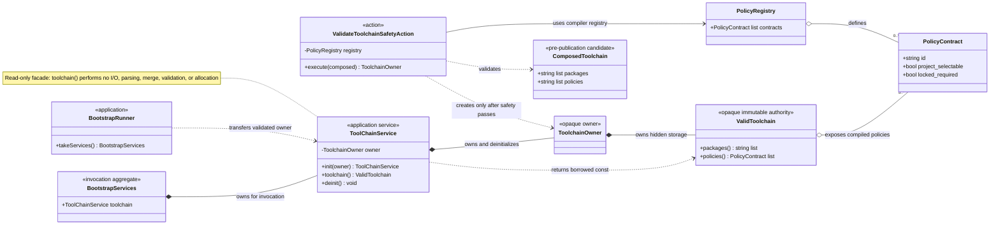

```mermaid
classDiagram
    direction LR

    class ValidateToolchainSafetyAction {
        <<action>>
        -PolicyRegistry registry
        +execute(composed) ToolchainOwner
    }

    class ComposedToolchain {
        <<pre-publication candidate>>
        +string list packages
        +string list policies
    }

    class PolicyRegistry {
        +PolicyContract list contracts
    }

    class BootstrapRunner {
        <<application>>
        +takeServices() BootstrapServices
    }

    class BootstrapServices {
        <<invocation aggregate>>
        +ToolChainService toolchain
    }

    class ToolChainService {
        <<application service>>
        -ToolchainOwner owner
        +init(owner) ToolChainService
        +toolchain() ValidToolchain
        +deinit() void
    }

    class ToolchainOwner {
        <<opaque owner>>
    }

    class ValidToolchain {
        <<opaque immutable authority>>
        +packages() string list
        +policies() PolicyContract list
    }

    class PolicyContract {
        +string id
        +bool project_selectable
        +bool locked_required
    }

    ValidateToolchainSafetyAction --> PolicyRegistry : uses compiler registry
    ValidateToolchainSafetyAction ..> ComposedToolchain : validates
    ValidateToolchainSafetyAction ..> ToolchainOwner : creates only after safety passes
    BootstrapRunner ..> ToolChainService : transfers validated owner
    BootstrapServices *-- ToolChainService : owns for invocation
    ToolChainService *-- ToolchainOwner : owns and deinitializes
    ToolchainOwner *-- ValidToolchain : owns hidden storage
    ToolChainService ..> ValidToolchain : returns borrowed const
    ValidToolchain o-- "0..*" PolicyContract : exposes compiled policies
    PolicyRegistry o-- "0..*" PolicyContract : defines

    note for ToolChainService "Read-only facade: toolchain() performs no I/O, parsing, merge, validation, or allocation"
```
