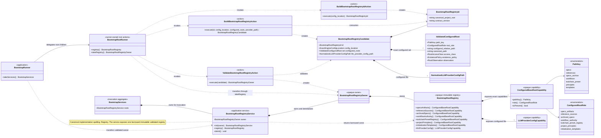

```mermaid
classDiagram
    direction LR

    class BuildBootstrapRootRegistryIdAction {
        <<action>>
        +execute(config_location) BootstrapRootRegistryId
    }

    class BuildBootstrapRootRegistryAction {
        <<action>>
        +execute(id, config_location, configured_roots, provider_path) BootstrapRootRegistryCandidate
    }

    class ValidateBootstrapRootRegistryAction {
        <<action>>
        +execute(candidate) BootstrapRootRegistryOwner
    }

    class BootstrapRootRegistryId {
        +string canonical_project_root
        +string contract_version
    }

    class BootstrapRootRegistryCandidate {
        +BootstrapRootRegistryId id
        +ExactEngineConfigLocation config_location
        +ValidatedConfiguredRoot set configured_roots
        +NormalizedLLMProviderConfigPath llm_provider_config_path
    }

    class ValidatedConfiguredRoot {
        +PathKey path_key
        +ConfiguredRootRole root_role
        +string configured_relative_path
        +string canonical_path
        +RootAccessClass access_class
        +ExistencePolicy existence_policy
        +RootObservation observation
    }

    class BootstrapRunner {
        <<application>>
        +takeServices() BootstrapServices
    }

    class BootstrapRootRunner {
        <<runner-owned root actions>>
        +registry() BootstrapRootRegistry
        +takeRegistry() BootstrapRootRegistryOwner
    }

    class BootstrapServices {
        <<invocation aggregate>>
        +BootstrapRootRegistryService roots
    }

    class BootstrapRootRegistryService {
        <<application service>>
        -BootstrapRootRegistryOwner owner
        +init(owner) BootstrapRootRegistryService
        +registry() BootstrapRootRegistry
        +deinit() void
    }

    class BootstrapRootRegistryOwner {
        <<opaque owner>>
    }

    class BootstrapRootRegistry {
        <<opaque immutable registry>>
        +specsArtifacts() ConfiguredBaseRootCapability
        +referenceSources() ConfiguredBaseRootCapability
        +archivedSpecs() ConfiguredBaseRootCapability
        +workflowAuthority() ConfiguredBaseRootCapability
        +toolchainPresetRegistry() ConfiguredBaseRootCapability
        +projectPrinciples() ConfiguredBaseRootCapability
        +initializationTemplates() ConfiguredBaseRootCapability
        +llmProviderConfig() LLMProviderConfigCapability
    }

    class ConfiguredBaseRootCapability {
        <<opaque capability>>
        +pathKey() PathKey
        +role() ConfiguredRootRole
        +isPresent() bool
    }

    class LLMProviderConfigCapability {
        <<opaque capability>>
    }

    class PathKey {
        <<enumeration>>
        specs
        references
        specs_archive
        workflows
        toolchain_preset
        principles
        templates
    }

    class ConfiguredRootRole {
        <<enumeration>>
        specs_artifacts
        reference_sources
        archived_specs
        workflow_authority
        toolchain_preset_registry
        project_principles
        initialization_templates
    }

    BuildBootstrapRootRegistryIdAction ..> BootstrapRootRegistryId : creates
    BuildBootstrapRootRegistryAction ..> BootstrapRootRegistryId : consumes
    BuildBootstrapRootRegistryAction ..> BootstrapRootRegistryCandidate : creates
    BootstrapRootRegistryCandidate *-- BootstrapRootRegistryId
    BootstrapRootRegistryCandidate *-- "7" ValidatedConfiguredRoot : exact configured set
    BootstrapRootRegistryCandidate *-- "1" NormalizedLLMProviderConfigPath : configured file
    ValidateBootstrapRootRegistryAction ..> BootstrapRootRegistryCandidate : validates
    ValidateBootstrapRootRegistryAction ..> BootstrapRootRegistryOwner : creates
    BootstrapRunner --> BootstrapRootRunner : delegates root children
    BootstrapRootRunner ..> BuildBootstrapRootRegistryIdAction : invokes
    BootstrapRootRunner ..> BuildBootstrapRootRegistryAction : invokes
    BootstrapRootRunner ..> ValidateBootstrapRootRegistryAction : invokes
    BootstrapRootRunner ..> BootstrapRootRegistryOwner : transfers through takeRegistry
    BootstrapRunner ..> BootstrapRootRegistryService : transfers validated owner
    BootstrapServices *-- BootstrapRootRegistryService : owns for invocation
    BootstrapRootRegistryService *-- BootstrapRootRegistryOwner : owns and deinitializes
    BootstrapRootRegistryOwner *-- BootstrapRootRegistry : stores
    BootstrapRootRegistryService ..> BootstrapRootRegistry : returns borrowed const
    BootstrapRootRegistry *-- "7" ConfiguredBaseRootCapability : exposes exact capabilities
    BootstrapRootRegistry *-- "1" LLMProviderConfigCapability : exposes configured file
    ConfiguredBaseRootCapability --> PathKey
    ConfiguredBaseRootCapability --> ConfiguredRootRole

    note for BootstrapRootRegistryService "Canonical implementation spelling: Registry. The service exposes one borrowed immutable validated registry"
```
