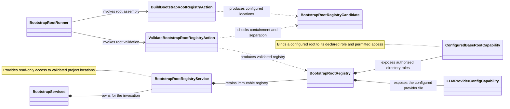

Main responsibilities and relationships for configured project locations.

Directory roles cover specifications, references, archives, workflows, toolchain
presets, principles and templates. Consumers use the capability for their
declared operation. Configured locations alone do not grant unrestricted access.
