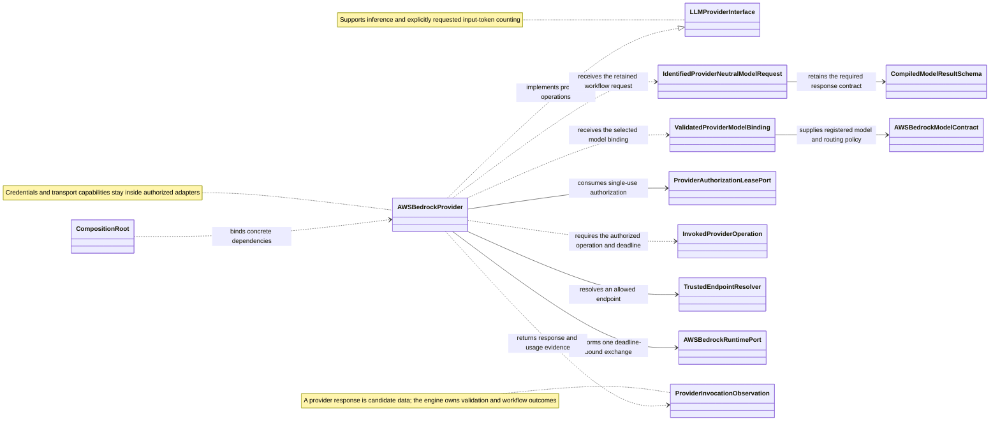

Main responsibilities and relationships at the AWS Bedrock provider boundary.

[F0007](../features/F0007-AWSBedrockProvider.md) owns exact request/model/input/
deadline binding and actual token reporting. Originating-step identity and
resources follow [ADR 0012](../decisions/0012-workflow-owned-model-request.md);
workflow policy controls retries and preserves failure/cancellation.
