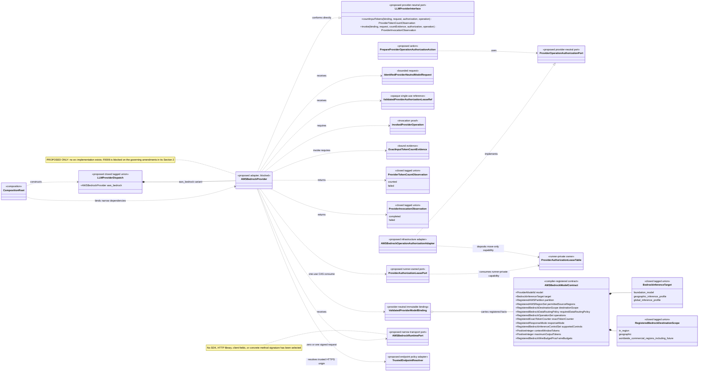

```mermaid
classDiagram
    direction LR

    class LLMProviderInterface {
        <<proposed provider-neutral port>>
        +countInputTokens(binding, request, authorization, operation) ProviderTokenCountObservation
        +invoke(binding, request, countEvidence, authorization, operation) ProviderInvocationObservation
    }

    class AWSBedrockProvider {
        <<proposed adapter; blocked>>
    }

    class LLMProviderDispatch {
        <<proposed closed tagged union>>
        +AWSBedrockProvider aws_bedrock
    }

    class CompositionRoot {
        <<composition>>
    }

    class ValidatedProviderModelBinding {
        <<provider-neutral immutable binding>>
    }

    class IdentifiedProviderNeutralModelRequest {
        <<bounded request>>
    }

    class ValidatedProviderAuthorizationLeaseRef {
        <<opaque single-use reference>>
    }

    class InvokedProviderOperation {
        <<invocation proof>>
    }

    class ExactInputTokenCountEvidence {
        <<bound evidence>>
    }

    class ProviderTokenCountObservation {
        <<closed tagged union>>
        counted
        failed
    }

    class ProviderInvocationObservation {
        <<closed tagged union>>
        completed
        failed
    }

    class ProviderOperationAuthorizationPort {
        <<proposed provider-neutral port>>
    }

    class PrepareProviderOperationAuthorizationAction {
        <<proposed action>>
    }

    class AWSBedrockOperationAuthorizationAdapter {
        <<proposed infrastructure adapter>>
    }

    class ProviderAuthorizationLeaseTable {
        <<runner-private owner>>
    }

    class ProviderAuthorizationLeasePort {
        <<proposed runner-owned port>>
    }

    class AWSBedrockRuntimePort {
        <<proposed narrow transport port>>
    }

    class TrustedEndpointResolver {
        <<proposed endpoint policy adapter>>
    }

    class AWSBedrockModelContract {
        <<compiler-registered contract>>
        +ProviderModelId model
        +BedrockInferenceTarget target
        +RegisteredAWSPartition partition
        +RegisteredAWSRegionSet permittedSourceRegions
        +RegisteredBedrockDestinationScope destinationScope
        +RegisteredBedrockDataRoutingPolicy requiredDataRoutingPolicy
        +RegisteredBedrockOperationSet operations
        +RegisteredExactTokenCounter exactTokenCounter
        +RegisteredResponseMode responseMode
        +RegisteredBedrockInferenceControlSet supportedControls
        +PositiveInteger contextWindowTokens
        +PositiveInteger maximumOutputTokens
        +RegisteredBedrockWireBudgetProof wireBudgets
    }

    class BedrockInferenceTarget {
        <<closed tagged union>>
        foundation_model
        geographic_inference_profile
        global_inference_profile
    }

    class RegisteredBedrockDestinationScope {
        <<closed tagged union>>
        in_region
        geographic
        worldwide_commercial_regions_including_future
    }

    AWSBedrockProvider ..|> LLMProviderInterface : conforms directly
    LLMProviderDispatch *-- AWSBedrockProvider : aws_bedrock variant
    CompositionRoot ..> LLMProviderDispatch : constructs
    CompositionRoot ..> AWSBedrockProvider : binds narrow dependencies
    AWSBedrockProvider ..> ProviderAuthorizationLeasePort : one-use CAS consume
    AWSBedrockProvider ..> AWSBedrockRuntimePort : zero or one signed request
    AWSBedrockProvider ..> TrustedEndpointResolver : resolves trusted HTTPS origin
    AWSBedrockProvider ..> ValidatedProviderModelBinding : receives
    AWSBedrockProvider ..> IdentifiedProviderNeutralModelRequest : receives
    AWSBedrockProvider ..> ValidatedProviderAuthorizationLeaseRef : receives
    AWSBedrockProvider ..> InvokedProviderOperation : requires
    AWSBedrockProvider ..> ExactInputTokenCountEvidence : invoke requires
    AWSBedrockProvider ..> ProviderTokenCountObservation : returns
    AWSBedrockProvider ..> ProviderInvocationObservation : returns
    ValidatedProviderModelBinding o-- AWSBedrockModelContract : carries registered facts
    AWSBedrockModelContract *-- BedrockInferenceTarget
    AWSBedrockModelContract *-- RegisteredBedrockDestinationScope
    PrepareProviderOperationAuthorizationAction ..> ProviderOperationAuthorizationPort : uses
    AWSBedrockOperationAuthorizationAdapter ..|> ProviderOperationAuthorizationPort : implements
    AWSBedrockOperationAuthorizationAdapter ..> ProviderAuthorizationLeaseTable : deposits move-only capability
    ProviderAuthorizationLeasePort ..> ProviderAuthorizationLeaseTable : consumes runner-private capability

    note for AWSBedrockProvider "PROPOSED ONLY: no src implementation exists; F0006 is blocked on the governing amendments in its Section 2"
    note for AWSBedrockRuntimePort "No SDK, HTTP library, client fields, or concrete method signature has been selected"
```
